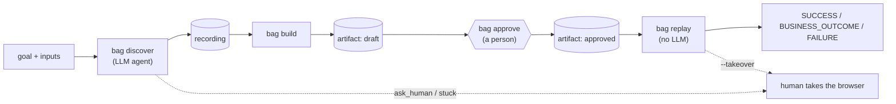

# Bank Automate GPT (`bag`)

An AI agent learns a task in a legacy bank web app **once**, saves it as a small YAML file (an *artifact*), and then repeats it **without any AI**. If the automation gets stuck, a person can take over the browser. Every run leaves redacted evidence behind.

It runs against a fake legacy bank app included in this repo. The full write-up, with diagrams and an honest list of limits, is in [REPORT.md](REPORT.md).



## Quick start

Windows, Python 3.11 or newer (developed on 3.12).

```
python -m venv .venv
.venv\Scripts\python -m pip install -e .
.venv\Scripts\python -m playwright install chromium
copy .env.example .env
```

Edit `.env`: set `BAG_PROVIDER` (`anthropic`, `gemini` or `openai`), `BAG_MODEL`, that provider's API key, and `BANK_USER` / `BANK_PASSWORD` (any values; the bank app uses them as its login).

Then, in two terminals:

```
bag bank
```
```
bag discover --goal "Log in and find the savings balance for the member" --input member_id=1001
bag build evidence\recordings\<recording>.json --name member-balance
bag approve member-balance
bag replay member-balance --input member_id=1003
```

Try the other paths:

```
bag replay member-balance --input member_id=9999            # business outcome, exit code 2
bag replay member-balance --input member_id=1003 --headed --takeover
bag resume                                                   # from another terminal, to resume a paused run
scripts\make_evidence.ps1                                    # four evidence runs + evidence\INDEX.md
```

Use `bag <command> --help` for every option. If `bag` is not found, use `.venv\Scripts\bag`.

## Commands

| Command | What it does |
|---|---|
| `bag bank` | start the fake bank on `127.0.0.1:5000` |
| `bag discover` | the AI agent learns a task and writes a recording |
| `bag build` | turn a recording into a draft artifact |
| `bag approve` | review a draft artifact and mark it approved |
| `bag replay` | run an approved artifact with no LLM |
| `bag resume` | tell a paused run that the person is done |
| `bag list` | list saved artifacts |

## Configuration

Set in `.env` (copy of `.env.example`):

| Variable | Meaning |
|---|---|
| `BAG_PROVIDER`, `BAG_MODEL` | which LLM to use for discovery |
| `ANTHROPIC_API_KEY` / `GEMINI_API_KEY` / `OPENAI_API_KEY` | only the chosen provider's key is needed |
| `BAG_BASE_URL` | optional, for OpenAI-compatible servers (Ollama, OpenRouter) |
| `BANK_URL` | where the bank app is (default `http://127.0.0.1:5000`) |
| `BANK_USER`, `BANK_PASSWORD` | the bank's login; kept out of artifacts and logs as `{{secret:NAME}}` |
| `BANK_POPUP`, `BANK_SLOW`, `BANK_PERM`, `SESSION_TTL` | optional fault switches: popup, slow pages, permission denied, session timeout |

Safety rules (allowed addresses, risky button names, blurred areas) are in [config/safety.yaml](config/safety.yaml). If that file is missing or invalid, nothing runs.

## Tests

```
.venv\Scripts\python -m pytest -q
```

The tests launch real Chromium against the fake bank. No test calls a live LLM.

## Layout

| Path | Contents |
|---|---|
| `bag/bankapp/` | the fake legacy bank (Flask) |
| `bag/surface/` | the one interface to a page, and the Playwright implementation |
| `bag/llm/` | Anthropic, Gemini and OpenAI-compatible adapters |
| `bag/agent/` | the discovery loop and recorder |
| `bag/artifact/` | artifact schema, builder and store |
| `bag/replay/` | the replay engine (never imports the LLM code) |
| `bag/safety/` | guard, approval, redaction, audit log |
| `bag/handoff/` | human takeover and resume |
| `bag/logging.py` | per-run evidence folders |
| `config/` | safety rules |
| `artifacts/` | saved artifacts |
| `evidence/` | run logs, recordings and the evidence index |
| `scripts/` | `make_evidence` helper |
| `tests/` | pytest suite |

`notes/` exists but is currently empty.