# Bank Automate GPT (`bag`)

`bag` teaches an AI agent to do a job in an old-fashioned bank web app **once**, saves what it learned as a small YAML file (an **artifact**), and then repeats that job as often as needed **without any AI**. When a step cannot be done, the run pauses and a person takes over the browser. Every run leaves a redacted log behind as evidence.

Everything runs on one machine against a fake legacy bank that ships with this repo, so it can be tried and checked without touching anything real.

- **Learn once:** `bag discover` gives an LLM a goal in plain English and lets it work the bank's pages step by step. Every step is recorded.
- **Save:** `bag build` turns the recording into a draft artifact. `bag approve` lets a person read it and mark it approved.
- **Repeat many times:** `bag replay` runs the approved artifact with new inputs. No LLM is called, and a test enforces that.
- **Stay safe:** every action passes a safety guard first, risky clicks need a human "yes", and passwords and account numbers never reach logs, artifacts or the AI.
- **Ask a person:** with `--takeover`, a step that cannot be done hands the visible browser to a person, who resumes the run with Enter or `bag resume`.

The longer write-up, with design reasons and an honest list of limits, is in [REPORT.md](REPORT.md).

---

## Contents

1. [Setup](#setup)
2. [Demo path: discover, then replay](#demo-path-discover-then-replay)
3. [Running without live services](#running-without-live-services)
4. [Evidence you can check](#evidence-you-can-check)
5. [How it works: the big picture](#how-it-works-the-big-picture)
6. [Each part in detail](#each-part-in-detail)
7. [More walkthroughs](#more-walkthroughs)
8. [Commands](#commands)
9. [Configuration](#configuration)
10. [Tests](#tests)
11. [Project layout](#project-layout)
12. [Known limits](#known-limits)

---

## Setup

Windows, Python 3.11 or newer (developed and tested on 3.12). On macOS or Linux use `source .venv/bin/activate` and `cp` instead of `copy`; this path is untested.

```
git clone <this repository>
cd BankAutomateGPT
python -m venv .venv
.venv\Scripts\activate
python -m pip install -e .
python -m playwright install chromium
copy .env.example .env
```

Then edit `.env`:

| Setting | Needed for | Value |
|---|---|---|
| `BANK_USER`, `BANK_PASSWORD` | everything | any values you like; the fake bank uses them as its login, and the agent and replay type them as `{{secret:...}}` |
| `BAG_PROVIDER` | discovery only | `anthropic`, `gemini` or `openai` |
| `BAG_MODEL` | discovery only | a model name for that provider, e.g. `claude-sonnet-5-5` or `gemini-3.5-flash-lite` |
| `ANTHROPIC_API_KEY` / `GEMINI_API_KEY` / `OPENAI_API_KEY` | discovery only | only the chosen provider's key |
| `BAG_BASE_URL` | optional | an OpenAI-compatible server (Ollama, OpenRouter, ...) with `BAG_PROVIDER=openai` |

Leave the fault switches (`BANK_POPUP` and so on) commented out. If `bag` is not found, the venv is not active: run `.venv\Scripts\activate` or call `.venv\Scripts\bag`.

---

## Demo path: discover, then replay

Terminal 1, start the fake bank and leave it running:

```
bag bank
```

Terminal 2:

```
# 1. The agent learns the task (uses the LLM). It prints the recording's path at the end.
bag discover --goal "Log in and find the savings balance for the member" --input member_id=1001

# 2. Turn the recording into a draft artifact (artifacts\member-balance.v1.yaml).
bag build evidence\recordings\<recording printed above>.json --name member-balance

# 3. Read it and approve it.
bag approve member-balance

# 4. Replay it for a different member, with no LLM.
bag replay member-balance --input member_id=1003
```

Expected: `SUCCESS` and `savings_balance = 250000.00` in about a second. Add `--headed` to any `discover` or `replay` to watch the browser.

Then show error handling:

```
bag replay member-balance --input member_id=9999        # BUSINESS OUTCOME: NOT_FOUND, exit code 2
bag replay member-balance --input memberid=1003         # refused: unknown input, exit code 1
bag replay member-balance --input member_id=1003 --start-url "http://127.0.0.1:5000/login?popup=1&slow=1"
                                                        # injected popup and slow pages: still SUCCESS
```

Before approving, check the `read` step and remove any step that clicks the maintenance popup's OK button (see [Known limits](#known-limits)).

---

## Running without live services

Only discovery calls an LLM. Everything else is local: the bank is a local Flask app, and replay never loads LLM code.

- **Replay the committed artifact, no API key needed.** With `bag bank` running and only `BANK_USER` / `BANK_PASSWORD` set:

  ```
  bag replay evidence\artifacts\member-balance.v1.yaml --input member_id=1003
  ```

- **Produce the whole evidence set without an LLM:** `scripts\make_evidence.ps1 --skip-discovery` (or `sh scripts/make_evidence.sh --skip-discovery`). It starts a bank if none is running, uses a built-in sample artifact instead of discovery, then runs a replay, a replay with injected faults, and a handoff that resumes itself. It writes four `0N-*` folders under `evidence/` and rewrites `evidence/INDEX.md`.
- **Tests:** `python -m pytest -q`. They drive a real Chromium against the fake bank. The agent is tested with a scripted stand-in for the LLM, and the provider adapters against fakes. No test calls a live API.

---

## Evidence you can check

The full index is [evidence/INDEX.md](evidence/INDEX.md). Discovery used the model `gemini-3.5-flash-lite`. Every run folder holds `steps.jsonl` (one redacted JSON line per event) and `result.json` (how it ended); the `demo-replay-*` folders also hold `console.txt` with the exact command and terminal output.

### Replay demo: success, not-found, bad input, injected faults, handoff

All five replay the same discovered artifact, [evidence/artifacts/member-balance.v1.yaml](evidence/artifacts/member-balance.v1.yaml), with no LLM.

| Run | Result |
|---|---|
| [demo-replay-1-success](evidence/demo-replay-1-success/) | member 1003: `SUCCESS` in 0.4 s, `savings_balance = 250000.00` |
| [demo-replay-2-not-found](evidence/demo-replay-2-not-found/) | member 9999: `BUSINESS_OUTCOME NOT_FOUND`, exit code 2 |
| [demo-replay-3-bad-input](evidence/demo-replay-3-bad-input/console.txt) | misspelt input: refused before the browser opens, exit code 1 |
| [demo-replay-4-faults](evidence/demo-replay-4-faults/) | injected popup and slow pages: popup dismissed, `SUCCESS` in 6.7 s |
| [demo-replay-5-handoff](evidence/demo-replay-5-handoff/) | an impossible step: paused, intervention file and blurred screenshot written, resumed by `bag resume`, `SUCCESS` |

### Task 1: read a member's savings balance

| What | File | Result |
|---|---|---|
| Discovery (AI learns the task, member 1001) | [recording](evidence/recordings/20261006-032607-log-in-and-find-the-savings-balance-for-.json), [run folder](evidence/20261006-032607-discovery-log-in-and-find-the-savings-balance-for-/) | `done` in 16.4 s, 7 steps, read `$12,450.75`. 2 targets repaired (see [the agent loop](#3-the-ai-agent-loop)). |
| The artifact built from it | [evidence/artifacts/member-balance.v1.yaml](evidence/artifacts/member-balance.v1.yaml) | 6 steps, input `member_id`, output `savings_balance` (decimal), status `approved` |
| Replay, member **1003** (not the member used in discovery) | [run folder](evidence/20261006-033732-replay-member-balance-v1/) | `SUCCESS` in 0.86 s, `savings_balance = 250000.00` |
| Replay, member 1001 | [run folder](evidence/20261006-033738-replay-member-balance-v1/) | `SUCCESS` in 0.86 s, `savings_balance = 12450.75` |
| More replays of the same artifact | [034114](evidence/20261006-034114-replay-member-balance-v1/), [034225](evidence/20261006-034225-replay-member-balance-v1/) | `SUCCESS` in 1.4 s and 1.3 s |
| An earlier discovery, member 1002 | [run folder](evidence/20261006-010244-discovery-log-in-and-find-the-savings-balance-for-/) | `done` in 107 s, read `$830.10`, 3 targets repaired |

Discovery took 16 to 107 seconds and many LLM calls; replay of the same job takes about one second and none.

### Task 2: open a new sub-account (a money-moving flow)

| What | File | Result |
|---|---|---|
| Discovery (member 1001, Savings, nickname, opening balance 20000) | [recording](evidence/recordings/20261006-033610-log-in-to-the-bank-search-for-the-member.json), [run folder](evidence/20261006-033610-discovery-log-in-to-the-bank-search-for-the-member/) | `done` in 25.7 s, 11 actions, read the new number `SA-1001-02`. 4 targets repaired. The amount field and the Confirm click both needed a human "yes". |
| The artifact built from it | [evidence/artifacts/create-subaccount.v1.yaml](evidence/artifacts/create-subaccount.v1.yaml) | 11 steps, inputs `member_id`, `account_type`, `nickname`, `initial_balance`, output `sub_account_number`, status `approved` |
| Replay | [run folder](evidence/20261006-033903-replay-create-subaccount-v1/) | `SUCCESS` in 7.7 s, created `SA-1001-03`. The safety guard stopped twice (amount field, Confirm button) and a person approved both. |

### Human handoff

| What | File | Result |
|---|---|---|
| A replay with a step that cannot be done ([artifacts/handoff-test.v1.yaml](artifacts/handoff-test.v1.yaml), step 6 clicks a button named "Does Not Exist") | [demo-replay-5-handoff/interventions/](evidence/demo-replay-5-handoff/interventions/), [screenshot](evidence/demo-replay-5-handoff/screenshots/handoff-step6.png) | Paused with `LocatorNotFound` at step 6 and handed over the browser; resumed by `bag resume`, then the run carried on to `SUCCESS`. `transitions.jsonl` shows `AUTOMATION → PAUSED_FOR_HUMAN → HUMAN → AUTOMATION`. |
| Discovery that got stuck | (in the git-ignored `evidence/interventions/`) | The AI tried to *type* into a drop-down three times in a row. The loop guard stopped it as `stuck` and saved a help request. |

### Failures kept on purpose

| What | File | What it shows |
|---|---|---|
| Replay that failed | [run folder](evidence/20261006-032143-replay-member-balance-new-v1/) | `FAILURE` at step 4 with a screenshot. The artifact had a recorded "click OK on the popup" step that duplicated the built-in popup handling. See [Known limits](#known-limits). |
| Discovery cut short by the provider | [recording](evidence/recordings/20261006-033302-log-in-to-the-bank-search-for-the-member.json), [run folder](evidence/20261006-033302-discovery-log-in-to-the-bank-search-for-the-member/) | Google answered `503 UNAVAILABLE` after 12 steps; there is no retry for that. |
| Older attempts | [174858](evidence/recordings/20261004-174858-log-in-and-find-the-savings-balance-for-.json), [175021](evidence/recordings/20261004-175021-log-in-and-find-the-savings-balance-for-.json), [175346](evidence/recordings/20261004-175346-log-in-and-find-the-savings-balance-for-.json) | Provider errors (503 "high demand", 429 quota) on other Gemini models. |

### What to look for in the files

- **No secrets.** Logins appear only as `{{secret:BANK_USER}}` and `{{secret:BANK_PASSWORD}}`, inputs as `{{member_id}}` and so on. Search any file for your own `.env` values: they are not there.
- **Repairs.** `steps.jsonl` of a discovery run has `"event": "repaired"` lines showing the model's broken target and the fixed one.
- **Fallbacks and retries.** A replay's `steps.jsonl` says which locator matched for every step (`via primary` or `fallback N`).
- **Typed outputs.** Replays return `250000.00` (a decimal), not the page text `$250,000.00`.

---

## How it works: the big picture

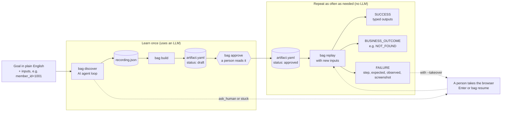

**Why split it this way.** An LLM is good at working out an unfamiliar page, but it is slow, costs money per call, and may do something different each time. A bank wants the opposite for routine work: the same steps every time, fast, and reviewed by a person beforehand. So the LLM is used once to *find* the steps, a person checks them, and from then on a plain program repeats them.

### How the code is layered

Arrows point from the caller to the thing it uses.

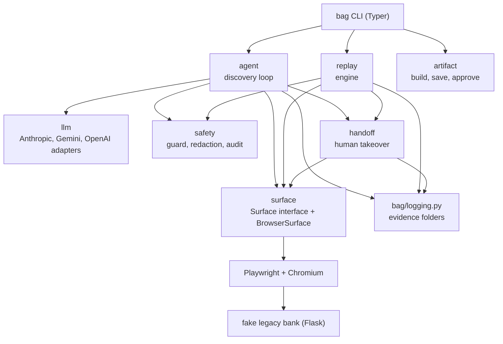

Two rules are enforced by tests, not just by habit:

- `replay`, `artifact` and `logging` never import the LLM code or any LLM library. A test starts a fresh Python process and checks.
- Nothing outside `surface` imports Playwright. Everything that touches a page goes through one interface.

---

## Each part in detail

### 1. The fake legacy bank

Code: [`bag/bankapp/`](bag/bankapp/). Start it with `bag bank` (always `127.0.0.1`, port 5000 by default).

A small Flask app written to look like a 2000s bank: table layouts, `<font>` tags, inline styles, **no `id` attributes anywhere** (a test fails if one appears), and the member search form inside an unnamed `<iframe>`. Fields are labelled three different ways on purpose: a real `<label>`, plain text beside the box, and no caption at all. These are exactly the things that make pages hard for automation.

Four fake members live in [`members.json`](bag/bankapp/members.json):

| Member id | Name | Savings balance |
|---|---|---|
| 1001 | Priya Sharma | $12,450.75 |
| 1002 | Marcus Webb | $830.10 |
| 1003 | Elena Rossi | $250,000.00 |
| 1004 | Tomasz Nowak | $57.25 |

The login is whatever you put in `BANK_USER` and `BANK_PASSWORD` in `.env`.

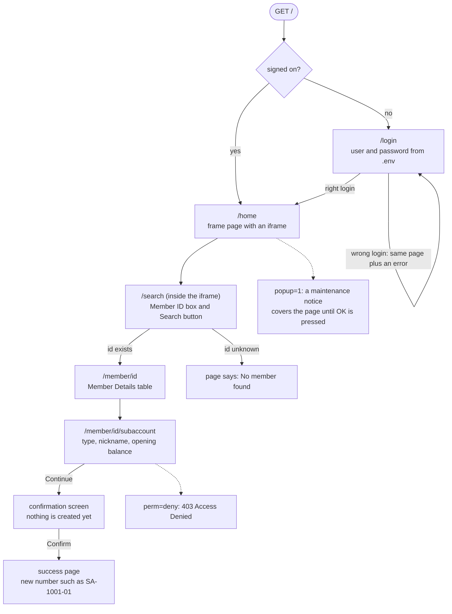

**Fault switches** let you break the bank on purpose to test how the automation copes. Each can be set for everyone with an environment variable (read once, when `bag bank` starts) or for one browser session with a URL flag such as `/home?popup=1` (remembered in the session cookie until set back to `0`).

| Switch | URL flag | Env var | What happens |
|---|---|---|---|
| popup | `popup=1` | `BANK_POPUP` | `/home` shows a "System maintenance notice" that blocks clicks until OK is pressed |
| slow | `slow=N` | `BANK_SLOW` | every response waits N seconds first (at most 30) |
| perm | `perm=deny` | `BANK_PERM` | the sub-account pages answer 403 "Access Denied" |
| ttl | `ttl=N` | `SESSION_TTL` | the session ends N seconds after sign-on |

Sub-accounts are kept in memory, numbered `SA-<member>-NN`, and forgotten when the bank restarts.

### 2. The surface layer: the only door to the page

Code: [`bag/surface/`](bag/surface/).

The agent, the replay engine and the human handoff never talk to Playwright directly. They talk to one interface, `Surface`, and only `BrowserSurface` knows that a real Chromium browser is underneath. That keeps the rest of the code simple and means another kind of app (for example a desktop app) would only need a new surface.

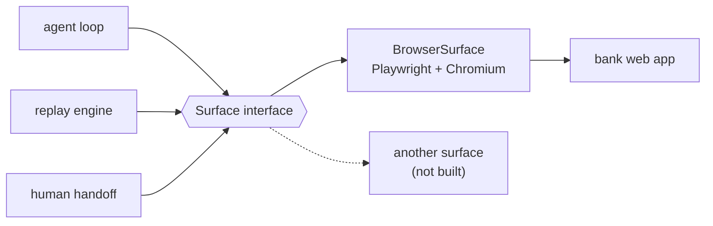

| Group | Methods | Used by |
|---|---|---|
| Act | `goto`, `click`, `type`, `read`, `wait_for` | agent, replay |
| See | `observe` (address, title, page outline, screenshot), `describe` (other ways to find an element) | agent |
| Replay helpers | `locate`, `is_visible`, `current_url`, `frame_urls`, `pause` | replay, safety |
| Takeover helpers | `add_init_script`, `evaluate_in_frames`, `bring_to_front` | handoff |

**A `Target` says which element.** It uses exactly one way of finding it: `role` + `name` (a button called "Sign On"), `label` (the field labelled "User name:"), `text` (the words on the page), or `css` (a CSS selector). Mixing two ways is rejected.

**Finding an element** searches the main page and every iframe, and refuses to guess:

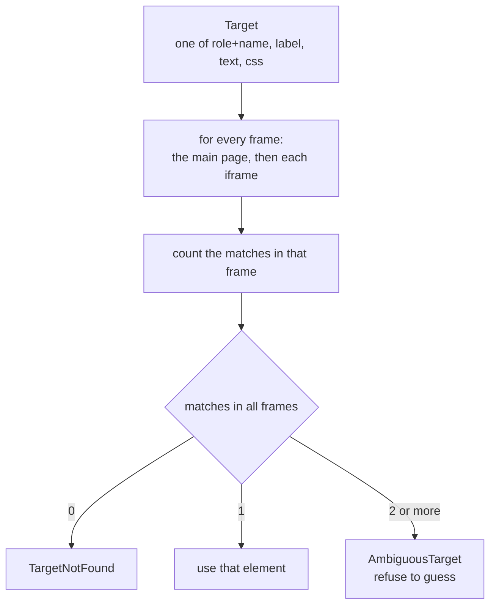

Clicking the wrong button is the one mistake that matters in a bank, so two matches is an error, not "pick the first".

**What the AI sees** (`observe()`): the page's accessibility tree as text (the same outline a screen reader uses, including iframe content), plus a screenshot. Fields with no name, like the bank's Member ID box, show up in that tree only as a bare `textbox`, so `observe()` adds a list of them with a CSS selector each. Screenshots are blurred before they leave this method (see [Safety](#6-safety-guardrails)).

**Secrets by placeholder.** The AI never sees a real password. It writes `{{secret:BANK_PASSWORD}}` or `{{member_id}}`, and `type()` swaps in the real value at the last moment. Only secrets named in `BAG_SECRET_NAMES` (default `BANK_USER,BANK_PASSWORD`) can be asked for.

### 3. The AI agent loop

Code: [`bag/agent/`](bag/agent/), LLM adapters in [`bag/llm/`](bag/llm/).

`bag discover --goal "..." --input member_id=1001` runs a loop. Each turn is **one fresh call** to the LLM carrying: the goal, the *names* of the inputs and secrets (never their values), the history so far written as short sentences, and the current page. The model must answer by calling one tool, `act`, with one of six actions:

| Action | Meaning |
|---|---|
| `click` | click a Target |
| `type` | type text (usually a `{{placeholder}}`) into a Target |
| `read` | read a Target's text and save it as a named output |
| `wait` | wait until a Target appears |
| `done` | the goal is reached |
| `ask_human` | the AI cannot continue on its own |

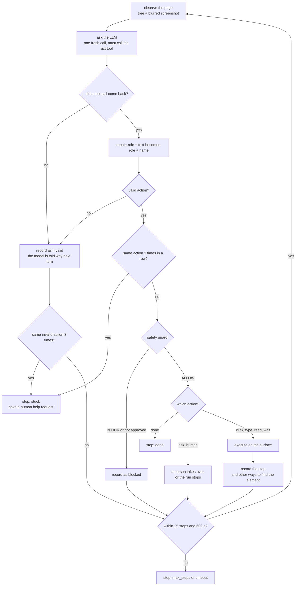

**Mistakes are fed back, not fatal.** An invalid, blocked or failed step goes into the next prompt ("Your last action was invalid: ... Valid target examples: ...") so the model can correct itself.

**Help for small models.** Small models repeat predictable mistakes. The loop has four defences:

1. **One repair.** A target with both `role` and `text` becomes `role` + `name`. Nothing else is guessed. Each repair is logged; the evidence above shows 2 to 6 per run.
2. **Feedback** on invalid actions, with examples.
3. **Plain history**, e.g. "typed into password field (value hidden) - OK", because a password box always looks empty in the outline.
4. **A loop guard.** The same action three times in a row stops the run as `stuck` and saves a help request.

**The recorder** ([`recorder.py`](bag/agent/recorder.py)) rewrites `evidence/recordings/<time>-<goal>.json` after every step. For each element it also stores the other ways to find it (`describe()`), which become fallbacks in the artifact.

**Any LLM.** `BAG_PROVIDER` picks `anthropic`, `gemini` or `openai`. The `openai` adapter plus `BAG_BASE_URL` also covers OpenAI-compatible servers (Ollama, OpenRouter and others). The rest of the code only uses neutral message types, so switching provider is a `.env` change.

### 4. Turning the run into an artifact

Code: [`bag/artifact/`](bag/artifact/).

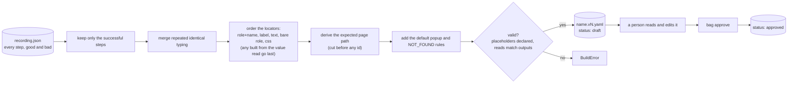

An artifact is a YAML file `artifacts/<name>.v<version>.yaml` with:

| Section | What it holds |
|---|---|
| `metadata` | name, version, app, description, `status` (draft or approved), start URL, source recording |
| `inputs` | each input's name, type (string, int, decimal) and optional regex pattern |
| `steps` | action, a **locator** (one primary target, ordered fallbacks, and the AI's reason), text to type, optional expected page |
| `outputs` | each value read and its type, cleaned up on replay (`$250,000.00` becomes `250000.00`) |
| `success_check` | which outputs must be present for SUCCESS |
| `known_outcomes` | page text that means a normal business answer, e.g. "No member found" → `NOT_FOUND` |
| `known_interruptions` | page text that means "click this to get it out of the way", e.g. the maintenance popup |

Every field is explained in comments in [`schema.py`](bag/artifact/schema.py). Loading is strict: unknown keys, placeholders that are not declared inputs, and `read` steps without a matching output are all errors.

**Why YAML and a person's approval.** A person has to be able to read what the bank automation will do before it runs unattended. YAML is readable, editable and shows clearly in a diff. Files are never overwritten (a rebuild gets the next version number), and saving refuses anything that contains a real secret.

`bag approve <name>` prints the steps, inputs, outputs, outcomes and interruptions, then asks you to confirm (`--yes` skips the question). `bag list` shows every artifact and marks broken files as INVALID instead of crashing.

### 5. The replay engine (no LLM)

Code: [`bag/replay/`](bag/replay/).

`bag replay <name> --input member_id=1003` first **refuses** before touching the bank unless the artifact is approved, the inputs are exactly the declared ones and pass their type and pattern, and every secret the steps need is available. Then, for each step:

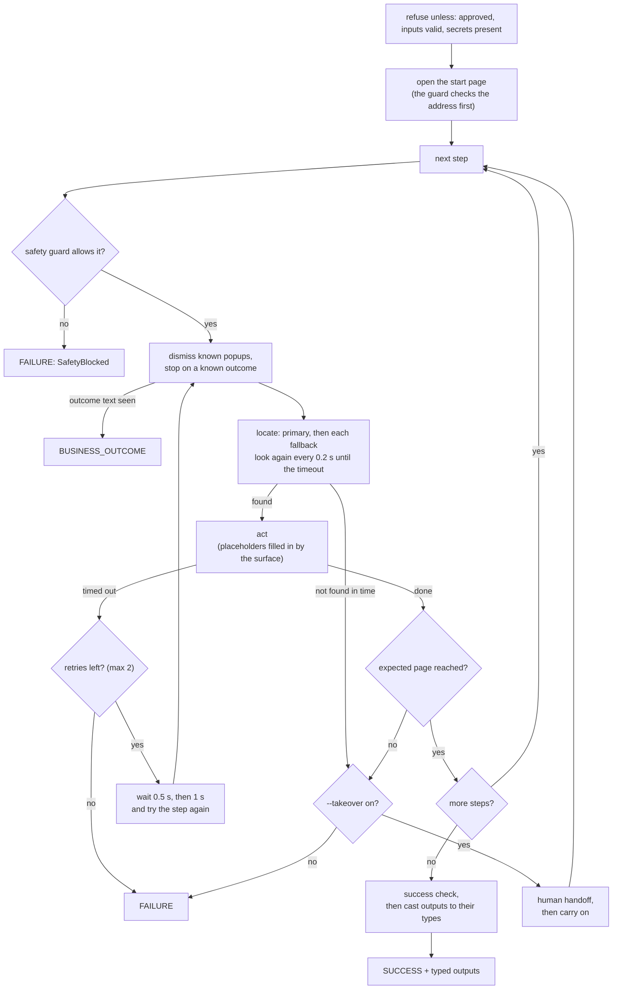

**Three endings and their exit codes:**

| Result | Exit code | Meaning |
|---|---|---|
| `SUCCESS` | 0 | every step worked; typed outputs are printed and saved |
| `BUSINESS_OUTCOME` | 2 | the bank gave a normal answer such as "No member found". Not a failure. |
| `FAILURE` | 1 | which step, what was expected, what was seen, and a screenshot |

A refused run also exits with 1.

**Fallbacks and retries solve different problems:**

| | Fallback | Retry |
|---|---|---|
| Fixes | the description of the element went stale | the app was slow |
| How | try another way to find the *same* element, right now | repeat the *same* step after a pause |
| Limit | every fallback in order, primary first | 2 retries (0.5 s, then 1 s), only for timeouts |

A step whose element cannot be found is never retried: waiting longer will not rename a button.

### 6. Safety guardrails

Code: [`bag/safety/`](bag/safety/), rules in [`config/safety.yaml`](config/safety.yaml).

Every action is judged **before** it touches the bank, in both discovery and replay. If the rules file is missing or invalid, nothing runs at all.

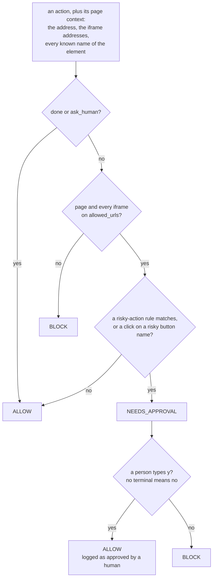

| Rule | Decision | Why a bank needs it |
|---|---|---|
| Address allowlist | BLOCK | a redirect or look-alike page could collect the real password |
| Risky buttons (confirm, submit, transfer, pay, delete, approve, ...) | NEEDS_APPROVAL | reading a balance can be repeated; moving money cannot be undone |
| Risky fields (amount, payee, IBAN, routing, PIN, OTP, CVV, ...) | NEEDS_APPROVAL | these are where a wrong or injected value does damage |
| Fail closed | no rules or no terminal means "no" | the safe answer to "no rules" is "no" |
| Audit log | every decision is one JSON line in `evidence/safety-decisions.jsonl` | "why did the robot do that?" needs an answer on record |

The sub-account evidence shows this working: the amount field and the Confirm button each stopped for a human "yes".

**Redaction**, so nothing sensitive is written down or sent to the AI:

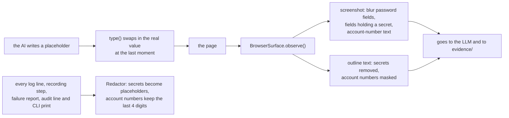

### 7. Human handoff

Code: [`bag/handoff/`](bag/handoff/).

Off unless you pass `--takeover`, which needs `--headed` (a person cannot work in a browser they cannot see).

**When it triggers:** in replay, when a step's element cannot be found or the expected page is not reached. In discovery, when the AI calls `ask_human` or the loop guard says `stuck`. It does **not** trigger for a safety block, a business outcome or a slow page that ran out of retries.

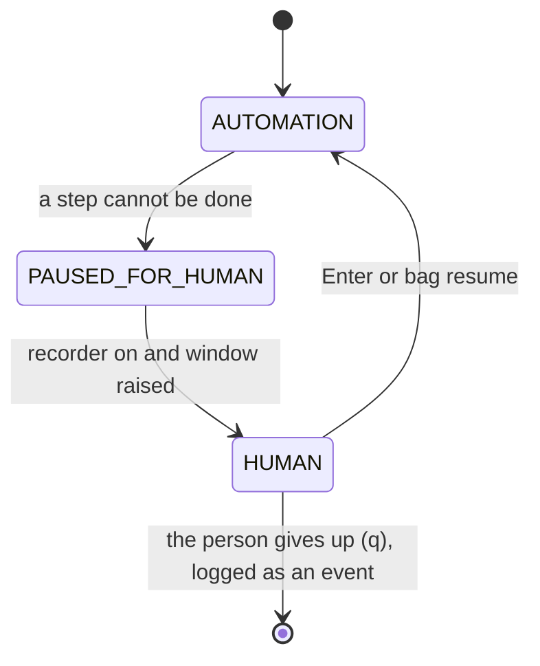

Only these three moves are allowed, and each one is logged to `transitions.jsonl`.

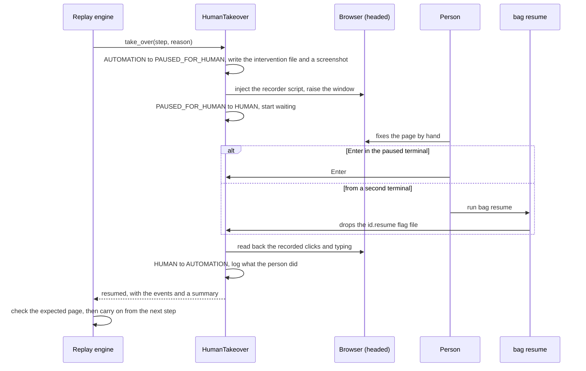

- **Files written:** `<id>.json` (goal, step, reason, expected, observed, address, screenshot, status), a blurred screenshot, and `<id>.human-events.json` with what the person clicked and typed. Password, card and code fields are masked; their values are never read.
- **Resuming:** press Enter in the paused terminal, or run `bag resume` (or `bag resume <id>`) from another terminal. Type `q` to give up. The wait also ends after 30 minutes or if the browser window is closed.
- **After resuming:** the engine checks the step's expected page. A `read` step is read again, since a person cannot hand a value over; other steps count as done by the person. More than 3 handoffs in one run fail it.
- **In discovery,** the person's time does not count against the 600 s limit, and the next prompt tells the AI what the person did (never what they typed).

### 8. Logs and evidence

Code: [`bag/logging.py`](bag/logging.py), [`scripts/make_evidence.py`](scripts/make_evidence.py).

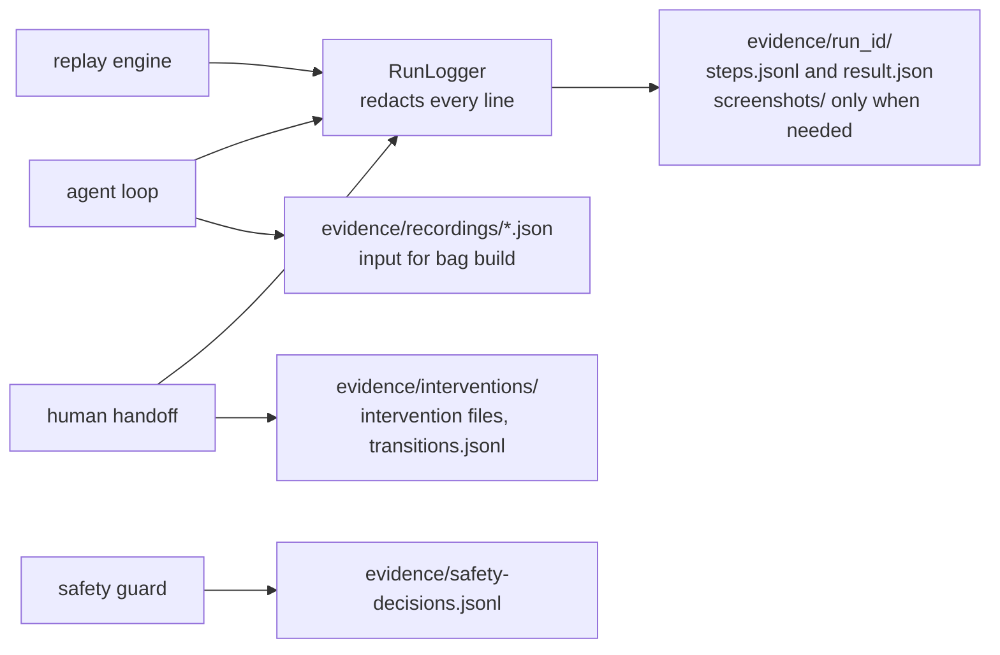

| File | What it holds |
|---|---|
| `evidence/<run_id>/steps.jsonl` | one redacted JSON line per event: `seq`, `time`, `source` (agent, replay or handoff), `event`, `step`, details |
| `evidence/<run_id>/result.json` | how the run ended: status, seconds, outputs, failure details, intervention ids |
| `evidence/<run_id>/screenshots/` | only after a failure, an unfinished discovery or a handoff |
| `evidence/recordings/` | one JSON file per discovery attempt |
| `evidence/interventions/` | handoff files (git-ignored) |
| `evidence/safety-decisions.jsonl` | the audit log (git-ignored) |

Run ids look like `<UTC time>-<kind>-<label>`. JSON lines were chosen because they are readable with any tool, safe to append to during a run, and survive a crash.

`scripts\make_evidence.ps1` (or `sh scripts/make_evidence.sh`) runs four standard runs in a row (discovery, replay, replay with popup and slow pages, handoff) and writes [`evidence/INDEX.md`](evidence/INDEX.md). It deletes and recreates its own four folders each time. `--skip-discovery` uses a built-in sample artifact instead of calling the LLM, and `--manual` lets you act in the handoff run yourself.

---

## More walkthroughs

These assume `bag bank` is running. The balance task is the [demo path](#demo-path-discover-then-replay) above.

### Open a sub-account

```
bag discover `
  --goal "Log in to the bank. Search for the member using member_id. On the member details page, open a new sub-account: set the account type to account_type, type nickname into the Nickname field, and type initial_balance into the opening balance field, then submit. On the confirmation screen, check the account type, nickname and amount are correct, then click Confirm. Finish when the success page shows the new sub-account number, and return it as output sub_account_number." `
  --input member_id=1001 --input account_type=Savings --input nickname=Atharva --input initial_balance=20000

bag build evidence\recordings\<the new recording>.json --name create-subaccount
bag approve create-subaccount

bag replay create-subaccount `
  --input member_id=1001 --input account_type=Savings --input nickname=Atharva --input initial_balance=20000
```

The guard asks for your approval on the amount field and on Confirm; answer `y`. Each replay creates a new sub-account.

### Try the human handoff

1. Copy an artifact and give it a step that cannot be done:

   ```
   copy artifacts\member-balance.v1.yaml artifacts\handoff-test.v1.yaml
   ```

   In the copy, change `name: member-balance` to `name: handoff-test`, and add this step just before the `read` step:

   ```yaml
   - action: click
     locator:
       primary:
         role: button
         name: Does Not Exist
       fallbacks: []
       why: Deliberately missing, to test the handoff.
   ```

2. Approve and replay it with a visible browser:

   ```
   bag approve handoff-test
   bag replay handoff-test --input member_id=1003 --headed --takeover --timeout 3
   ```

3. When it pauses, press **Enter** in that terminal, or run `bag resume` in another one. The run carries on and prints the balance. Look in `evidence\interventions\` for the files it wrote.

---

## Commands

| Command | What it does |
|---|---|
| `bag bank` | start the fake bank on `127.0.0.1:5000` |
| `bag discover` | the AI agent learns a task from `--goal` and `--input name=value` and writes a recording |
| `bag build RECORDING` | turn a recording into a draft artifact; `--name` sets its name, and the next free version is used |
| `bag approve NAME` | show an artifact (name, `name.v2` or a path) and mark it approved after you confirm; `--yes` skips the question |
| `bag replay NAME` | run an approved artifact with `--input name=value`, no LLM |
| `bag resume [ID]` | tell a paused run that the person is done |
| `bag list` | list saved artifacts, with broken ones shown as INVALID |

Useful options for `bag replay`:

| Option | Meaning |
|---|---|
| `--input name=value` | an input; repeat for several |
| `--headed` | show the browser window |
| `--takeover` | let a person take over when a step cannot be done (needs `--headed`) |
| `--timeout N` | seconds to wait for each element or expected page (default 10) |
| `--start-url URL` | where to begin, e.g. with fault flags |
| `--run-id`, `--evidence-dir` | name and place of the evidence folder |
| `--safety-config PATH` | a different rules file (default `config/safety.yaml`) |

`bag discover` also takes `--headed`, `--takeover`, `--run-id` and `--evidence-dir`. Run `bag <command> --help` for the full list.

---

## Configuration

`.env` (copy `.env.example`; it is git-ignored):

| Variable | Meaning |
|---|---|
| `BAG_PROVIDER` | `anthropic`, `gemini` or `openai` |
| `BAG_MODEL` | the model name for that provider |
| `ANTHROPIC_API_KEY` / `GEMINI_API_KEY` / `OPENAI_API_KEY` | only the chosen provider's key is needed |
| `BAG_BASE_URL` | optional, for OpenAI-compatible servers such as Ollama or OpenRouter |
| `BAG_EFFORT` | optional, Claude only: thinking depth (`low` keeps steps quick) |
| `BANK_URL` | where the bank runs (default `http://127.0.0.1:5000`) |
| `BANK_USER`, `BANK_PASSWORD` | the bank's login; only ever written as `{{secret:NAME}}` |
| `BAG_SECRET_NAMES` | which variables may be typed as `{{secret:NAME}}` (default `BANK_USER,BANK_PASSWORD`) |
| `BANK_POPUP`, `BANK_SLOW`, `BANK_PERM`, `SESSION_TTL` | optional fault switches, read when `bag bank` starts |

[`config/safety.yaml`](config/safety.yaml) holds the allowed addresses, risky button names, risky-action rules, extra areas to blur, and the audit log path.

---

## Tests

```
.venv\Scripts\python -m pytest -q
.venv\Scripts\python -m pytest tests/test_replay.py -q      # one file
```

The tests start the fake bank and drive a real Chromium against it. No test calls a live LLM: the agent is tested with a scripted stand-in, and the LLM adapters against fakes.

---

## Project layout

| Path | Contents |
|---|---|
| `bag/cli.py` | the `bag` command (Typer) |
| `bag/bankapp/` | the fake legacy bank (Flask) |
| `bag/surface/` | the `Surface` interface, `Target`, and the Playwright `BrowserSurface` |
| `bag/llm/` | Anthropic, Gemini and OpenAI-compatible adapters behind one neutral interface |
| `bag/agent/` | the discovery loop, the `act` tool, the recorder |
| `bag/artifact/` | artifact schema, builder and store |
| `bag/replay/` | the replay engine and error kinds (never imports the LLM) |
| `bag/safety/` | rules, guard, approval, redaction, audit log |
| `bag/handoff/` | control states, takeover, human recorder, resume |
| `bag/logging.py` | per-run evidence folders |
| `config/safety.yaml` | the safety rules |
| `artifacts/` | saved artifacts |
| `evidence/` | run folders, recordings, interventions, the evidence index |
| `scripts/` | `make_evidence` (`.py`, `.ps1`, `.sh`) |
| `tests/` | the pytest suite |
| `REPORT.md` | the full write-up |

---

## Known limits

The short version; [REPORT.md](REPORT.md) has the full list.

- **One fake bank, two tasks.** Nothing has been tried on a real site. There is no MFA, CAPTCHA or file download.
- **Only Gemini was used live.** The Anthropic and OpenAI adapters are tested against fakes only. Provider errors (503, 429) end a discovery run; there is no retry for them, and no token or cost tracking.
- **No drop-down action.** The six actions have no "select an option", so the AI cannot choose from a `<select>`. In the sub-account task the AI skipped the type box, and "Savings" was used because it is the form's default. The artifact declares `account_type`, but no step uses it, so replaying with `account_type=Checking` still opens a Savings sub-account.
- **Discovered locators can be brittle.** Both `read` steps found the value by a position-based CSS selector, and their only fallback is the exact value seen during discovery (`$12,450.75`, `SA-1001-02`), which can only match that one case. A reviewer should tighten them before approval.
- **A popup seen during discovery becomes a duplicate step.** If the bank shows the maintenance popup while discovering, the AI's "click OK" is saved as an ordinary step on top of the built-in popup handling, and replay then fails on it (the failed run above). Delete that step from the YAML before approving, and keep `BANK_POPUP` off while discovering.
- **Steps are a straight line.** No branches or loops beyond known outcomes and interruptions.
- **Safety rules are keyword lists** tuned to this bank. Account masking only catches 8 to 19 digit runs; names and balances are not masked; blurred screenshots are still sent to the LLM provider (`--no-screenshot` exists for text-only use).
- **Handoff records what the person did but does not learn from it.** The artifact is not updated.
- **Approval is a y/N in a terminal**, not tied to a named person.
- **Platform.** Tested on Windows 11 with Python 3.12 only.
