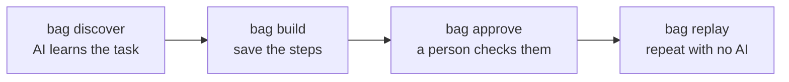

# Bank Automate GPT (`bag`)

An AI agent learns a task in an old-fashioned bank website **once**. The steps it took are saved to a small file called an **artifact**, and from then on the task can be repeated **without any AI**. If something goes wrong, a person can take over the browser and then hand it back.

The project includes its own fake bank website, so you can try everything on your own computer.



How it all works, and the design decisions, are in [REPORT.md](REPORT.md).

## Good to know first

- **Artifact:** a YAML file in `artifacts/` listing the steps, the inputs (e.g. `member_id`) and the outputs (e.g. `savings_balance`). A new artifact is a **draft**; replay refuses it until someone runs `bag approve`.
- **Secrets stay out of files.** Passwords are written only as `{{secret:BANK_PASSWORD}}` and filled in at the moment of typing. The AI never sees them.
- **Risky actions ask you first.** Clicking buttons like Confirm or typing a money amount stops and asks `y/N` in the terminal.
- **Fake members** you can use: `1001`, `1002`, `1003`, `1004`. Any other id gives "No member found".
- **Every run is logged** in its own folder under `evidence/` (`steps.jsonl` and `result.json`).

## Setup

You need Windows, Python 3.11 or newer, and Git. (macOS/Linux should work with `source .venv/bin/activate` and `cp`, but this was not tested.)

```
git clone <this repository>
cd BankAutomateGPT
python -m venv .venv
.venv\Scripts\activate
python -m pip install -e .
python -m playwright install chromium
copy .env.example .env
```

`pip install -e .` creates the `bag` command. If `bag` is "not recognized", the virtual environment is not active: run `.venv\Scripts\activate` again, or use `.venv\Scripts\bag`.

## Configuration

All settings live in `.env` (it is git-ignored, so your keys stay private).

**Required**

| Setting | What to put |
|---|---|
| `BANK_USER`, `BANK_PASSWORD` | Any username and password you like. The fake bank uses them as its login, and the automation types them in. |

**Only for `bag discover` (the AI part)**

| Setting | What to put |
|---|---|
| `BAG_PROVIDER` | `anthropic`, `gemini` or `openai` |
| `BAG_MODEL` | A model name for that provider, e.g. `claude-sonnet-5-5` or `gemini-3.5-flash-lite` |
| `ANTHROPIC_API_KEY` / `GEMINI_API_KEY` / `OPENAI_API_KEY` | The key for the provider you chose (only that one) |
| `BAG_BASE_URL` | Optional. To use another OpenAI-compatible service or a local model (Ollama, LM Studio, OpenRouter), set `BAG_PROVIDER=openai` and point this at it, e.g. `http://localhost:11434/v1` |
| `BAG_EFFORT` | Optional, Claude only: `low` keeps each step quick |

**Optional**

| Setting | What it does |
|---|---|
| `BANK_URL` | Where the bank runs. Default `http://127.0.0.1:5000` |
| `BAG_SECRET_NAMES` | Which `.env` values the automation may type. Default `BANK_USER,BANK_PASSWORD` |
| `BANK_POPUP=1`, `BANK_SLOW=3`, `BANK_PERM=deny`, `SESSION_TTL=60` | Make the fake bank misbehave on purpose: a popup, slow pages, "access denied", a short login session. Leave these off for normal use. They are read when `bag bank` starts, so restart it after changing them. |

**Safety rules** are in [config/safety.yaml](config/safety.yaml): which websites are allowed and which buttons and fields need your OK. If you run the bank on a different port, add that address to `allowed_urls`, otherwise every run is blocked. If the file is missing or broken, nothing runs.

## Demo: teach a task, then replay it

**Terminal 1:** start the fake bank and leave it running.

```
bag bank
```

**Terminal 2:**

```
# 1. The AI learns the task. At the end it prints "Recording saved to ...".
bag discover --goal "Log in and find the savings balance for the member" --input member_id=1001

# 2. Save the recording as an artifact (artifacts\member-balance.v1.yaml).
bag build evidence\recordings\<file name printed above>.json --name member-balance

# 3. Look at the steps and approve them (answer y).
bag approve member-balance

# 4. Repeat the task for another member, with no AI.
bag replay member-balance --input member_id=1003
```

The last command should print `SUCCESS` and `savings_balance = 250000.00` in about a second. Add `--headed` to any `discover` or `replay` command to watch the browser.

**See how errors are handled:**

```
bag replay member-balance --input member_id=9999     # member does not exist -> NOT_FOUND (exit code 2)
bag replay member-balance --input memberid=1003      # wrong input name -> refused (exit code 1)
bag replay member-balance --input member_id=1003 --start-url "http://127.0.0.1:5000/login?popup=1&slow=1"
                                                     # popup and slow pages -> still SUCCESS
```

**Try a human takeover:**

```
bag replay handoff-test --input member_id=1003 --headed --takeover --timeout 3
```

[`handoff-test`](artifacts/handoff-test.v1.yaml) has a step that can't be done on purpose. The run pauses and gives you the browser. Press **Enter** in that terminal, or run `bag resume` in another terminal, to hand control back. Type `q` instead to give up.

**A bigger task (opens a sub-account, asks for your OK on the amount and on Confirm):**

```
bag replay create-subaccount --input member_id=1001 --input account_type=Savings --input nickname=Demo --input initial_balance=500
```

### Tips for discovery

- Keep `BANK_POPUP` off while running `bag discover`. If the popup shows up during discovery, the AI's "click OK" gets saved as a step and later replays fail on it.
- Before approving, open the YAML file and check the steps. You can edit it by hand; it is checked again every time it loads.
- If the AI provider is busy (errors 503 or 429), just run `bag discover` again later.

## Running without live services

Only `bag discover` talks to an AI service. Everything else runs fully on your computer.

- **Replay the saved example, no AI key needed** (with `bag bank` running):

  ```
  bag replay evidence\artifacts\member-balance.v1.yaml --input member_id=1003
  ```

- **Make the full set of evidence without an AI:**

  ```
  scripts\make_evidence.ps1 --skip-discovery
  ```

  It starts a bank if none is running, uses a built-in example instead of discovery, and then runs a replay, a replay with a popup and slow pages, and a takeover that resumes itself. On bash use `sh scripts/make_evidence.sh --skip-discovery`. Note: it rewrites `evidence/INDEX.md`.
- **Run the tests:** `python -m pytest -q`. They drive a real browser against the fake bank, but never call a real AI.
- **A local model** (e.g. Ollama) can be used for discovery through `BAG_BASE_URL`, but this has not been tried.

## Commands

| Command | What it does | Useful options |
|---|---|---|
| `bag bank` | Start the fake bank at `http://127.0.0.1:5000` | `--port` |
| `bag discover` | Let the AI learn a task and record it | `--goal "..."`, `--input name=value` (repeat), `--headed`, `--takeover`, `--no-screenshot`, `--max-steps`, `--max-seconds` |
| `bag build RECORDING` | Turn a recording into a draft artifact | `--name`, `--version` |
| `bag approve NAME` | Show an artifact and approve it | `--yes` (skip the question) |
| `bag replay NAME` | Run an approved artifact, no AI | `--input name=value` (repeat), `--headed`, `--takeover`, `--timeout`, `--start-url` |
| `bag resume [ID]` | Hand control back to a paused run | |
| `bag list` | Show saved artifacts and their status | |

`NAME` can be `member-balance`, `member-balance.v2` or a file path. `--takeover` needs `--headed`. Run `bag <command> --help` for every option.

**Replay exit codes:** `0` success, `1` failure or refused, `2` a normal business answer such as "member not found".

## Evidence

[evidence/INDEX.md](evidence/INDEX.md) lists the real runs, with links:

- two AI discovery runs (check a balance, open a sub-account)
- the saved artifacts, in [evidence/artifacts/](evidence/artifacts/)
- replays that succeed, find no member, reject a bad input, cope with a popup and slow pages, and hand over to a person

Passwords never appear in any of these files.

## Project folders

| Folder | What's inside |
|---|---|
| `bag/` | The source code (one sub-folder per part: bank, browser layer, AI, artifact, replay, safety, takeover) |
| `config/` | Safety rules |
| `artifacts/` | Saved artifacts |
| `evidence/` | Logs and results of runs, and recordings from discovery |
| `scripts/` | The evidence script |
| `tests/` | Automated tests |

## Limits

This is a prototype, tested on one fake bank, on Windows, and with Gemini only. The full list of what is missing or weak is in the **Cuts** section of [REPORT.md](REPORT.md).
