# Bank Automate GPT (`bag`): report

`bag` teaches an AI to do one job in a legacy bank web app **once**. It saves what it learned as a small YAML file (an *artifact*). After a person approves that file, the job can be repeated as often as needed with **no AI involved**. If a step cannot be done, the run pauses and a person takes over in a visible browser. Every run leaves a redacted log behind as evidence.

I built it against a fake bank that I wrote myself, so everything here can be run and checked on one machine. About 5,500 lines of Python are in `bag/` and about 5,100 in `tests/`. All 498 tests pass (Windows 11, Python 3.12).

Two things to know before reading:

- **The live-AI evidence is thin.** The only live runs on record are 10 discovery attempts with Google Gemini models, and only one of them finished. Section 3 shows all ten, including why the others failed.
- **Everything below is checked against the code.** Where the code does less than you might expect, the text says so, and the **Cuts** section at the end collects it all.

The whole pipeline in one picture:

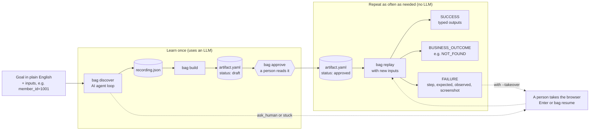

And how the code is layered. Arrows point from the caller to the thing it uses:

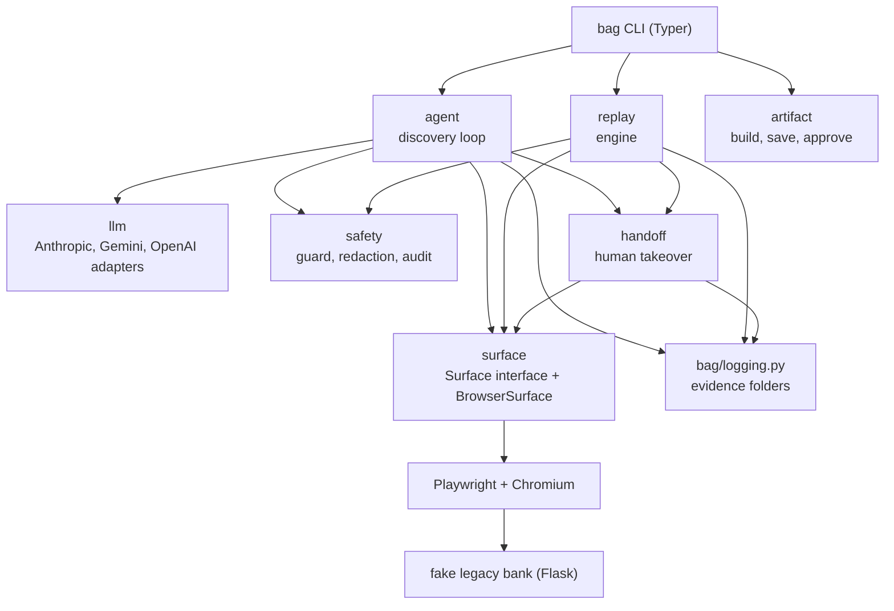

Two layering rules are enforced by tests, not just by habit: `replay`, `artifact` and `logging` never import the LLM code or an LLM library, and nothing outside `surface` imports Playwright.

## The fake legacy bank app

**What it is.** A small Flask app in [`bag/bankapp/`](bag/bankapp/), started with `bag bank` on `127.0.0.1:5000`. The host is fixed so it cannot be exposed by accident. It has four fake members:

| Member id | Name | Savings balance |
|---|---|---|
| 1001 | Priya Sharma | $12,450.75 |
| 1002 | Marcus Webb | $830.10 |
| 1003 | Elena Rossi | $250,000.00 |
| 1004 | Tomasz Nowak | $57.25 |

Account numbers are fake and shown masked, for example `XXXX-XXXX-1001`.

**Why a fake bank at all.** I needed a target that behaves the same every time, that I can break on purpose, and that cannot hurt anyone. A real bank offers none of those.

**Why Flask.** The point of the app is its HTML, and Flask is the smallest tool that lets me write every page by hand. There is no front-end framework, no database (members are a JSON file) and no build step.

**Deliberately old-fashioned.** Pages use table layouts, `` tags and inline styles. There are no `id` attributes anywhere, and a test fails if one appears. The member search form sits inside an unnamed `<iframe>`. Fields are labelled in three different ways on purpose: the user name uses a `<label>`, the password and Member ID boxes have plain text beside them, and the sub-account amount box has no caption at all. These are the things that make a page hard for a robot, and the rest of the project exists to cope with them.

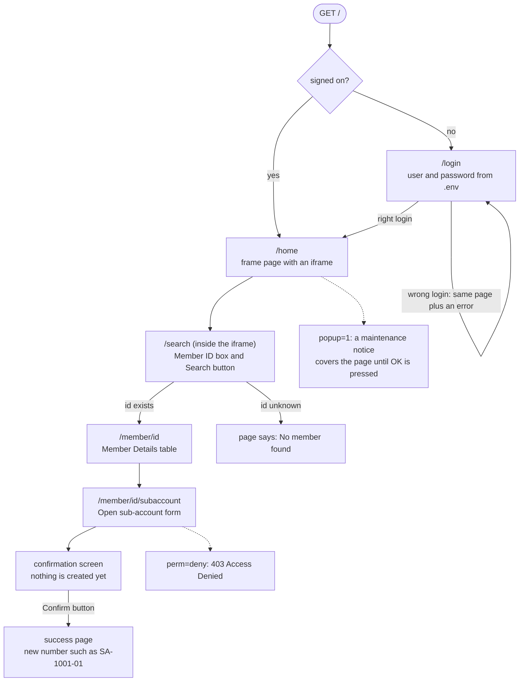

**Fault switches.** Each can be set with an environment variable (every visitor) or a URL flag such as `/login?popup=1` (stored in the visitor's session cookie until set back to `0`). The code is in [`bag/bankapp/faults.py`](bag/bankapp/faults.py).

| Switch | URL flag | Env var | What happens |
|---|---|---|---|
| popup | `popup=1` | `BANK_POPUP` | `/home` shows a "System maintenance notice" overlay that must be dismissed with OK |
| slow | `slow=N` | `BANK_SLOW` | every response waits N seconds first (capped at 30) |
| perm | `perm=deny` | `BANK_PERM` | the sub-account pages answer 403 "Access Denied"; viewing members still works |
| ttl | `ttl=N` | `SESSION_TTL` | the session ends N seconds after sign-on, counted from sign-on (not from the last click) |

**Sub-account flow.** The form checks its input (a type, a nickname of at most 20 characters, a deposit between 0 and 1,000,000), shows a confirmation screen, and only the Confirm button creates anything. Sub-accounts are numbered `SA-<member>-NN` and live in memory, so restarting the app forgets them. The deposit is recorded but does not change the savings balance.

**Smaller choices.** Sign-on compares the password in constant time. The session key is random on every start, so a restart signs everyone out. The session cookie has its own name (`bank_session`), because browsers share cookies across ports on `localhost`.

**Limits.** This is a toy. It has no MFA, no CAPTCHA, no CSRF protection, no real money movement and four members. It is a good test of *page awkwardness*, not of how a real bank behaves.

## The surface layer

**What it is.** Everything that touches a web page goes through one interface, in [`bag/surface/`](bag/surface/). The agent, the replay engine and the human handoff only ever call the interface's methods. Only one class, `BrowserSurface`, knows about Playwright.

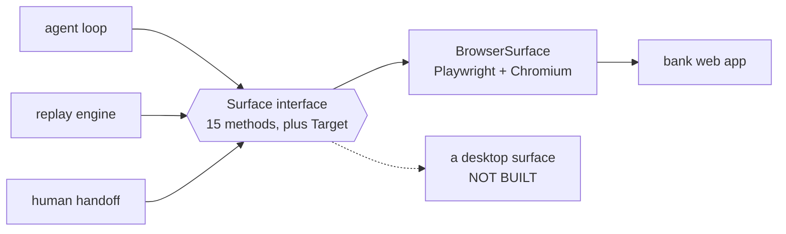

The 15 methods fall into four groups:

| Group | Methods |
|---|---|
| Act | `goto`, `click`, `type`, `read`, `wait_for` |
| See | `observe`, `describe` |
| Replay helpers (look right now, never wait) | `locate`, `is_visible`, `current_url`, `frame_urls`, `pause` |
| Human takeover helpers | `add_init_script`, `evaluate_in_frames`, `bring_to_front` |

**The `Target`.** One element is described by exactly one of `role` + `name`, `label`, `text` or `css`. A `Target` that mixes strategies is rejected when it is created. It is frozen, so it can be compared and stored.

**Finding an element** ([`locators.py`](bag/surface/locators.py)) searches the main page and every iframe. Zero matches raises `TargetNotFound`. More than one raises `AmbiguousTarget`: the code refuses to guess, because clicking the wrong button in a bank is the one mistake that matters.

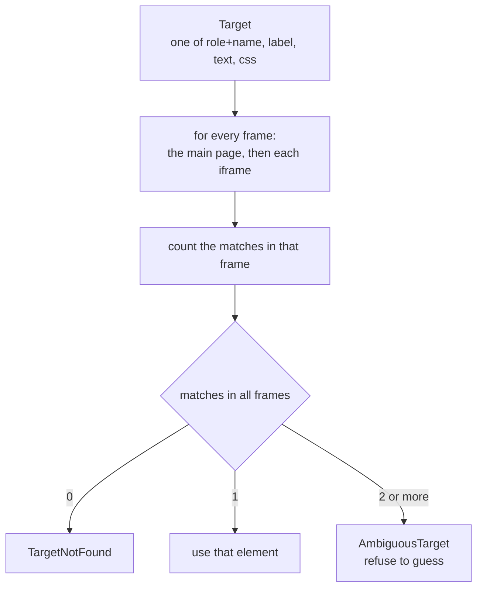

**What the AI sees** (`observe()`): the address, the title, a screenshot and the page's *accessibility tree* as text. Playwright's `aria_snapshot(mode="ai")` includes the content of iframes inline; I strip its `[ref=...]` tags because `Target` cannot use them. The bank's unlabelled fields appear in that tree only as a bare `textbox`, so `observe()` adds a list of such fields with a CSS selector for each. Without it the agent has no way to name the Member ID box.

**Fallbacks for later.** `describe()` gives several ways to find the same element (role+name, label, text, css, best first). Each candidate is checked to find exactly that element and nothing else. The recorder stores them so replay has something to fall back on.

**Secrets by placeholder.** The agent writes `{{member_id}}` or `{{secret:BANK_PASSWORD}}`; `type()` swaps in the real value at the last moment. Only secrets named in `BAG_SECRET_NAMES` (default `BANK_USER,BANK_PASSWORD`) can be requested, so a page that tricks the agent into asking for `{{secret:ANTHROPIC_API_KEY}}` gets an error instead.

**Why these choices.**

| Choice | Why |
|---|---|
| Playwright, not Selenium | Iframes, an accessibility snapshot and auto-waiting for elements to be clickable are built in, and it installs its own Chromium. |
| Accessibility tree, not raw HTML | It is much shorter and uses names a person would use ("Sign On") instead of layout noise. A screenshot goes along as well; `--no-screenshot` turns that off for text-only models. |
| An interface (a `Protocol`) | The agent and replay do not need to know it is Playwright underneath. |
| Refuse ambiguous matches | A wrong click costs more than a failed run. |

**Limits.** `BrowserSurface` is the only surface. The interface is shaped by the web (it has `css` and iframes), so a desktop version would need changes and I have not built one. Only Chromium is used.

## The AI agent loop

**What it is.** `bag discover --goal "..." --input member_id=1001` runs the loop in [`bag/agent/`](bag/agent/). Each step is **one stateless call** to the LLM. One message carries the goal, the *names* of the inputs and secrets (never their values), the step history written as plain sentences, and the current page. The model must answer by calling a single tool, `act`, with one of six actions: `click`, `type`, `read`, `wait`, `done` or `ask_human`.

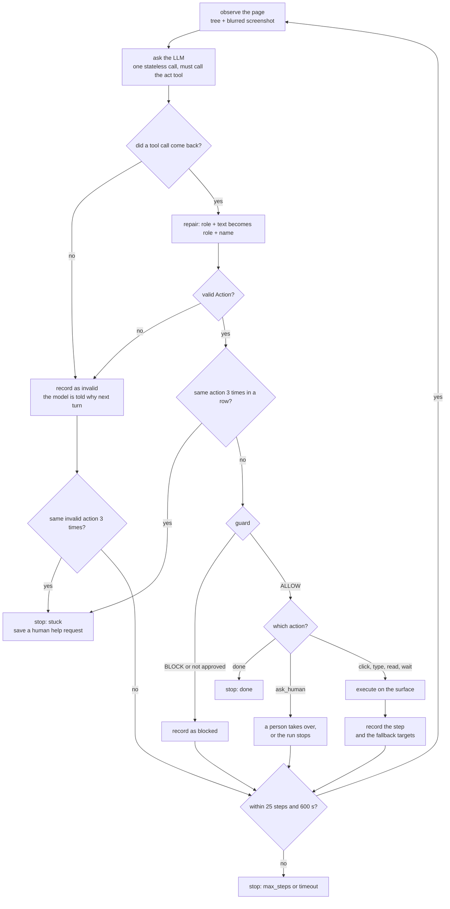

**Any LLM.** [`bag/llm/`](bag/llm/) translates between one neutral message format and three adapters: Anthropic, Gemini and OpenAI. The OpenAI adapter with `BAG_BASE_URL` also covers any server that speaks that format (Ollama, OpenRouter and similar). `BAG_PROVIDER` and `BAG_MODEL` in `.env` choose the model. I wrote the adapters myself on top of the official SDKs instead of using a wrapper library: they are short and easy to read. One wrinkle: some current models (for example `claude-sonnet-5-5`) reject *forced* tool use, so forcing is only a request and the prompt also demands a tool call.

**What the model is never handed.** It does not receive real inputs or secrets. It can still see whatever the page shows, such as a member's name and balance. Screenshots are blurred first (see Safety guardrails).

**Helping weak models.** The first live runs showed a small model repeating one mistake. The loop now has four defences, all in [`loop.py`](bag/agent/loop.py) and [`actions.py`](bag/agent/actions.py):

1. **One repair.** A target with both `role` and `text` becomes `role` + `name`. Nothing else is repaired or guessed. The repair is logged with the original and the fixed target.
2. **Feedback.** An invalid action is reported in the next prompt: "Your last action was invalid: ... Valid target examples: {role, name} | {label} | {text} | {css}."
3. **Plain history.** A step reads "typed into password field (value hidden) - OK", because a password field always looks empty in the tree.
4. **A loop guard.** The same action three times in a row ends the run as `stuck` and saves a human help request (the comparison ignores the wording of the `reason`).

**What actually happened.** These are all ten recorded attempts, from [`evidence/recordings/`](evidence/recordings/):

| # | Model | Ended | Why |
|---|---|---|---|
| 1 | gemini-3.8-flash | error | Google API answered 503 "high demand" |
| 2 | gemini-3.7-flash | error | 503 again |
| 3 | gemini-3.5-flash | error | 429 quota exceeded |
| 4 | gemini-3.5-flash-lite | timeout | 15 invalid actions: the `role` + `text` mistake, repeated |
| 5 | gemini-2.5-flash | error | 404, model no longer available |
| 6 | gemini-3.0-flash | error | 404, model not found |
| 7 | gemini-3.0-flash | error | 404, model not found |
| 8 | gemini-3.5-flash-lite | error | 14 invalid actions, then 429 quota |
| 9 | gemini-3.5-flash-lite | error | 6 invalid actions, then 429 quota |
| 10 | gemini-3.5-flash-lite | **done** | 7 steps, 65 seconds, 0 invalid, 2 repaired |

Run 10 is the only one made after the repair existed. It finished and read `$12,450.75`. That is **one data point, not a success rate**. In it, the model found the balance by typing the balance itself as the target text, which is a weak locator; Turn the run into an artifact shows how that was handled.

**Limits.** There is no retry or backoff for provider errors, so 503 and 429 end a run (five of the ten attempts). There is no token or cost tracking. Only one task was ever discovered live (read a member's balance).

## Turn the run into an artifact

**What it is.** `bag build <recording>` turns a discovery recording into a draft artifact; `bag approve <name>` shows a summary and asks for a yes. The artifact is a YAML file named `artifacts/<name>.v<version>.yaml`. Code: [`bag/artifact/`](bag/artifact/).

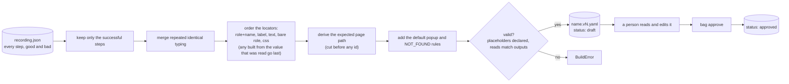

**What is in an artifact.** Metadata (name, version, status draft or approved), typed inputs (string, int or decimal, with an optional regex), steps, typed outputs, a success check, known outcomes (a text on the page means a normal answer like `NOT_FOUND`) and known interruptions (a text on the page means "click this to get rid of it"). Each step has an action, a locator (one primary target, ordered fallbacks and the reason the agent gave), the text to type, and an optional expected state. Every field is explained in comments in [`schema.py`](bag/artifact/schema.py).

**A real example.** I built an artifact from the committed run 10 (`bag build evidence/recordings/20261005-034837-log-in-and-find-the-savings-balance-for-.json`, written to a scratch folder). It produced six steps:

| Step | Action | Primary locator | Fallbacks |
|---|---|---|---|
| 1 | type | role `textbox` named "User name:" | label, css |
| 2 | type | css `input[name="pw"]` | none |
| 3 | click | role `button` named "Sign On" | css |
| 4 | type | css `input[name="mid"]` | none |
| 5 | click | role `button` named "Search" | text, css |
| 6 | read | css `body > table > tbody > tr:nth-of-type(4) > td:nth-of-type(2) > font` | the text `$12,450.75` |

Two honest observations. Step 6's main locator is a **position** in the page, so a layout change would break it. Its only fallback is the literal balance of member 1001, which can only match that one member. The builder had moved the value-based locator to the end (it would never have worked as the main one), but a human reviewing this file should still tighten step 6.

**Why YAML and pydantic.** YAML is readable, editable and shows up clearly in a diff, which matters because a person has to approve it. Pydantic checks it every time it loads: unknown keys are errors (a typo in `fallbacks` is caught), placeholders must be declared inputs, and every `read` step must match an output. Files are never overwritten (a new version gets a new number), and saving refuses anything containing a real secret value.

**Limits.**

- Steps are a straight line. There are no branches or loops. The only "branching" is the known outcomes and interruptions.
- The default popup and NOT_FOUND rules are added to every artifact, and they are written for *this* bank.
- Input descriptions come out as "Describe this input (member_id). Edit me." and inputs have no pattern until someone adds one.
- Approval is a y/N question in a terminal. It is not tied to a person or signed.

## The replay engine (no LLM)

**What it is.** `bag replay <artifact> --input member_id=1003` runs an approved artifact. Code: [`bag/replay/`](bag/replay/).

**It refuses before touching anything** unless the artifact is approved, the inputs are exactly the declared ones and pass their type and pattern, and every secret the steps need is available.

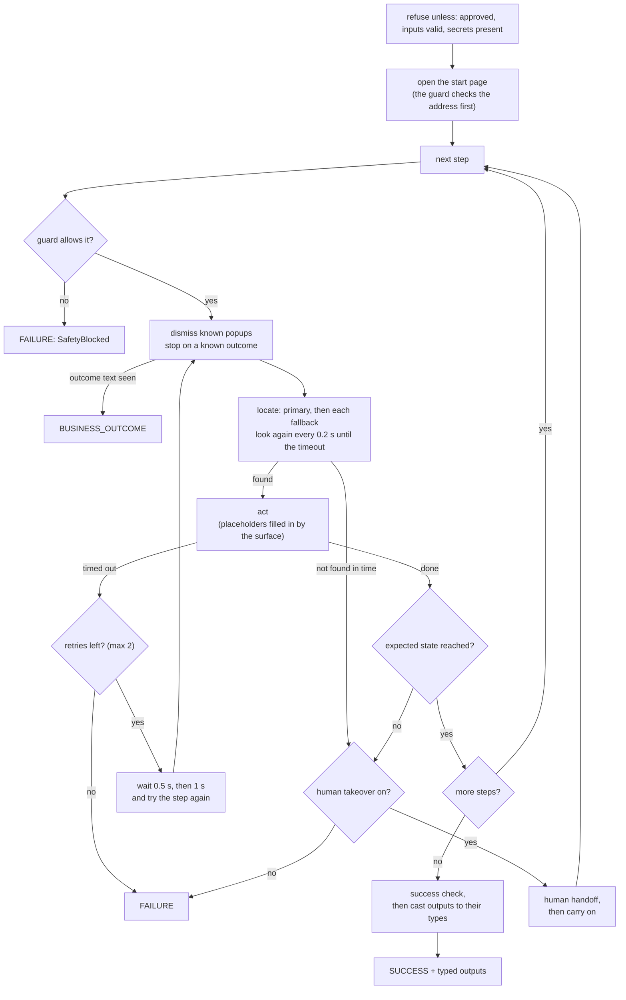

**Three possible endings.** `SUCCESS` returns outputs cast to their types (`"$250,000.00"` becomes the decimal `250000.00`). `BUSINESS_OUTCOME` (exit code 2) means the app gave a normal answer such as "No member found"; it is *not* a failure. `FAILURE` says which step, what was expected, what was seen, and saves a screenshot. Exit codes: 0 success, 1 failure or refused, 2 business outcome.

**Retries and fallbacks are different things:**

| | Fallback | Retry |
|---|---|---|
| Fixes | our description of the element went stale | the app was slow or the element not ready |
| How | tries another way to find the *same* element, right now | repeats the *same* step after a pause |
| Cost | no waiting | 0.5 s, then 1 s |
| Limit | every fallback in order, primary first | 2 retries, and only for timeouts |

A step that cannot find its element is never retried: waiting longer will not rename a button.

**No LLM, enforced.** Tests start a fresh Python process and check that importing `bag.replay`, `bag.artifact`, `bag.logging` and running the `bag replay` command load no `bag.llm`, no `bag.agent` and no LLM library.

**What I measured.** On the artifact built from run 10, in a scratch folder with a bank on another port. These runs are **not committed**, so treat the numbers as mine:

| Run | Result |
|---|---|
| Discovery (the AI, committed run 10) | 7 steps, 65 s |
| Replay for member 1003 (not the member used in discovery) | SUCCESS in 0.4 s: `savings_balance = 250000.00` |
| Replay with `popup=1` and `slow=1` | SUCCESS in 6.7 s, the popup was dismissed by a known interruption |
| Replay for member 9999 | BUSINESS_OUTCOME `NOT_FOUND`, exit code 2 |
| Replay of a copy ending in an impossible step, with `--headed --takeover` | paused, `bag resume` from another process resumed it, SUCCESS |

**Limits.** This proves the idea for **one task** on **one fake app**. Step 6's position-based locator (see above) would be the first thing to break on a changed page. The `expected` state is a page-address check, and an iframe loading a new page does not change the main address, so most steps have none.

## Safety guardrails

**What it is.** A guard that rules on every action *before* it touches the bank, plus redaction of everything written down. Code: [`bag/safety/`](bag/safety/). The rules live in [`config/safety.yaml`](config/safety.yaml). **If that file is missing or invalid, nothing runs.** A guard is a required argument of both loops, so leaving it out is an error, not a silent gap.

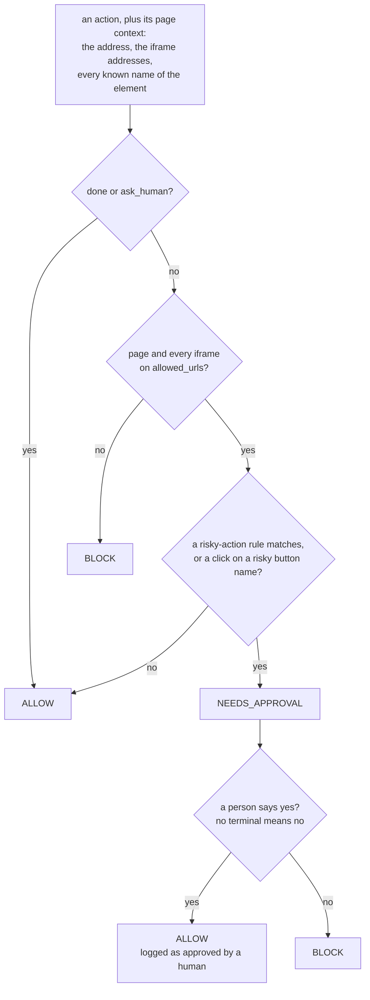

**Why each rule matters for a bank:**

| Rule | What it does | Why a bank needs it |
|---|---|---|
| Address allowlist (BLOCK) | the page and every iframe must be on `allowed_urls` | A redirect or look-alike domain could land the browser on a page the bank does not control. An agent that obeys what it sees would type the real password into it. |
| Risky buttons (NEEDS_APPROVAL) | a click on something named confirm, submit, transfer, pay, send money, delete, remove, close account, approve, authorize or wire | Reading a balance can be repeated; a transfer cannot be taken back. |
| Risky fields (NEEDS_APPROVAL) | typing into amount, payee, IBAN, routing or SWIFT fields, or a PIN, OTP, passcode or CVV | These are the fields where a typo or an injected value does real damage. |
| Fail closed | no config means no run; no terminal to ask means "no" | The safe answer to "no rules" is "no". |
| Audit log | every decision is one JSON line | "Why did the robot do that?" needs an answer on record. |

**Names are matched as whole words, any capitalisation**, so "Pay now" needs approval but "Payments" does not. The guard checks *every* known name of an element, so a button the agent targeted by CSS is still recognised by its role name.

**Redaction** (code: [`redact.py`](bag/safety/redact.py)):

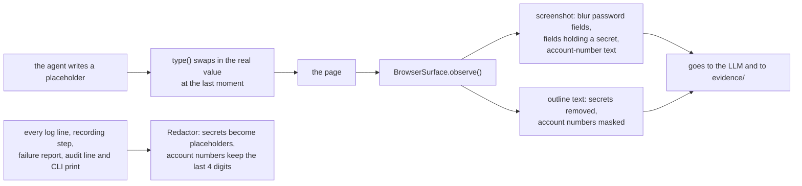

`observe()` is the single place screenshots come from, so every screenshot saved or sent to an LLM is already blurred. A pixelate-then-blur step is used because a plain blur on small text can sometimes be reversed.

**What I checked.** None of the three secret-looking values in my `.env` (the bank user, the bank password and the Gemini key) appear anywhere in the 14 text files under `evidence/`. Those files use the placeholder `{{secret:...}}` 37 times.

**Why these choices.** Rules are in a YAML file, not code, so a security reviewer can read and change them without touching Python. Pillow does the blurring because it is already a common dependency and the job is small. The guard works on plain duck-typed actions, so the agent's `Action` and the replay engine's `Step` pass through the same code.

**Limits.**

- The risky-button and risky-field rules are keyword lists tuned to this bank. A "Confirm" button labelled "Go" would not trigger them.
- The address is checked just before each action. A page could change in between.
- Masking only recognises 8 to 19 digit runs, so it misses IBANs with letters. Names, balances and addresses are not masked at all.
- Outputs are the point of a replay, so they stay real: the committed discovery run's `result.json` contains `$12,450.75`.
- Blurred screenshots are still sent to the LLM provider. `--no-screenshot` avoids that.
- A person's own actions during a handoff are not guarded (the guard checks the page again before the next automated step).
- The audit log (`evidence/safety-decisions.jsonl`) is git-ignored, so it is not part of the committed evidence. My copy holds 17 decisions, all ALLOW, from real discovery runs. **No approval prompt has been answered by a person in the recorded runs**; that path is covered by tests, including a real-browser one where the "person" is a function.

## Human handoff

**What it is.** When the automation cannot continue, a person gets the (visible) browser. Code: [`bag/handoff/`](bag/handoff/). It is off unless you pass `--takeover`, and `--takeover` requires `--headed`: a person cannot work in a window they cannot see, and a headless job that waited for one would hang.

**When it triggers.** In a replay: a step that raises `LocatorNotFound` or `UnexpectedState`. In discovery: the AI's `ask_human`, or the loop guard's `stuck`. It does **not** trigger for a safety block, a business outcome or a retried-out timeout.

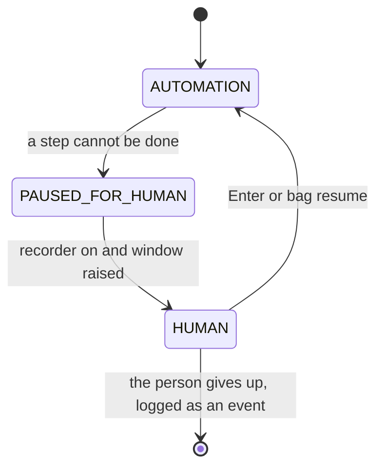

Only those three moves are allowed; anything else raises an error, and every move is logged.

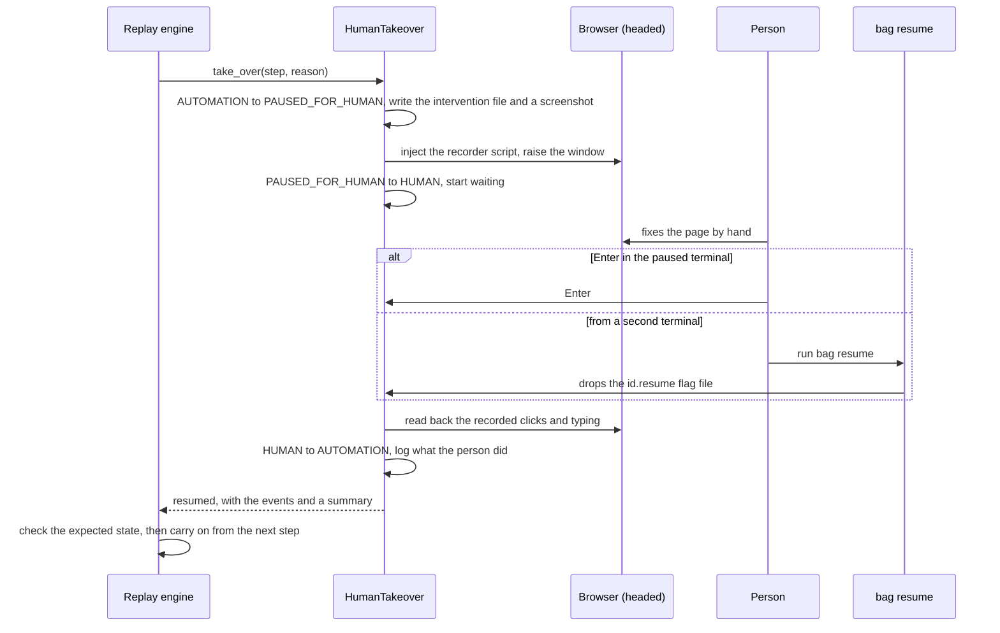

**What gets written when it pauses.** In `evidence/interventions/` (or the run folder): `<id>.json` (goal, step, reason, what was expected and seen, page address, screenshot path, status), a blurred screenshot, and later `<id>.human-events.json`. The terminal prints the same JSON and the instructions.

**Resuming.** The paused run waits for Enter *or* for the `<id>.resume` file that `bag resume` drops. Typing `q` gives up. A 30-minute timeout and a closed browser window also end the wait. After resuming the engine checks the step's expected state. If it is not reached the person is asked again, up to 3 times per run. A `read` step is read again, because a person cannot hand a value to the engine; other steps count as done by the person. In discovery, the human's time does not count against the time limit, and the next prompt tells the AI what the person did (never what they typed).

**Watching the person.** A small script is injected into every frame and records clicks and typing, each with a CSS path and an accessible name. Password, card-number and one-time-code fields are masked: their value is never read. One subtlety: when the person clicks something that loads a new page in the iframe, the browser throws away that frame's in-page list. So the script also copies its list into `sessionStorage` after each event, and the new page picks it up.

**Why these choices.** A flag *file* for `bag resume` needs no server and works across terminals. Keyboard input is polled, not read with `input()`, so the run can watch both the keyboard and the file, and a forgotten background reader cannot steal a later prompt. The recorder listens to `input` events only: `change` can arrive late and would blame the person for what the automation had typed.

**Limits.**

- What the person did is **recorded, not learned**. The artifact is not patched, and `bag build` only warns that a human took over.
- Tests drive a *simulated* person (a function acting through the browser). The evidence script's handoff run resumes itself with `bag resume`, so nobody acts in the window. There is no run in `evidence/` of a real person.
- Only the Windows keyboard path was run; the POSIX path (`select`) was not.
- `bag resume` is a local file with no authentication, and the 30-minute timeout and the limit of 3 are not CLI options.
- Frames from another origin are not recorded.

## Logs and evidence

**What it is.** [`bag/logging.py`](bag/logging.py) gives each run its own folder, `evidence/<run_id>/`, and the agent, the replay engine and the handoff all write to it.

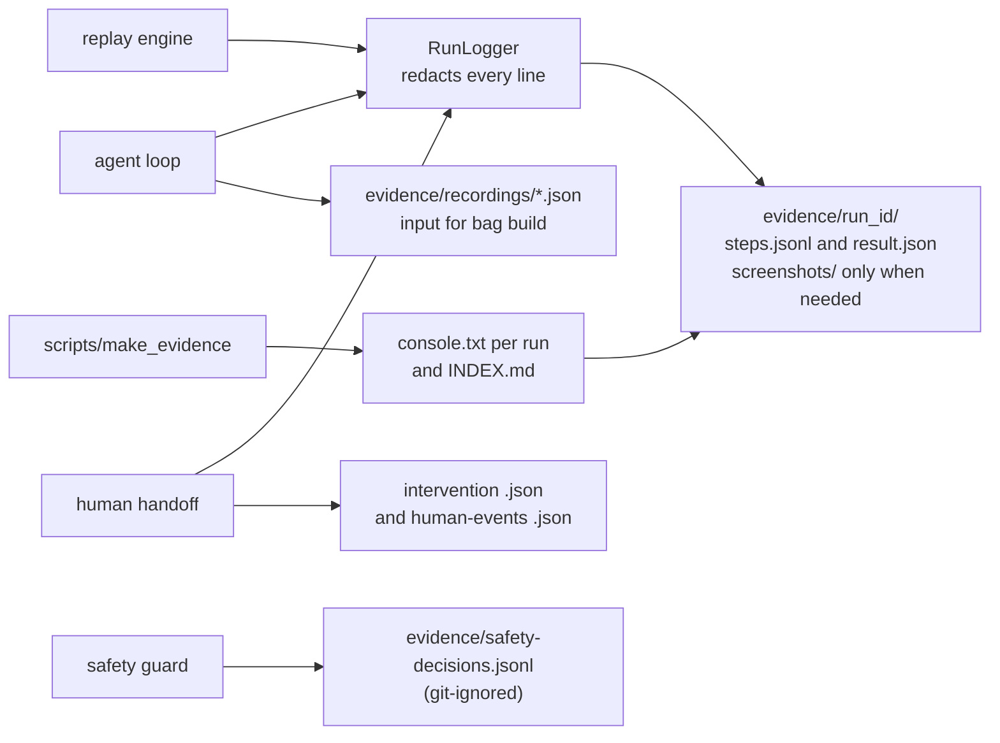

| File | What it holds |
|---|---|
| `steps.jsonl` | one redacted JSON line per event: `seq`, `time`, `source` (agent, replay or handoff), `event`, `step`, details |
| `result.json` | how the run ended: status, seconds, outputs, failure details, intervention ids, screenshot names |
| `screenshots/` | created on the first screenshot, so only after a failure, an unfinished discovery or a handoff |
| `console.txt` | what the terminal showed (written by the evidence script) |

Run ids look like `<UTC time>-<kind>-<label>` and get `-2`, `-3` if two runs start in the same second. A custom `--run-id` that is taken is refused. Everything is redacted on the way in, including the `result.json`.

**The evidence script** ([`scripts/make_evidence.ps1`](scripts/make_evidence.ps1) and `.sh`, both just call [`make_evidence.py`](scripts/make_evidence.py)) runs four runs in order and writes [`evidence/INDEX.md`](evidence/INDEX.md): `01-discovery` (needs the LLM, or `--skip-discovery` for a built-in sample artifact), `02-replay`, `03-replay-faults` (popup and slow pages) and `04-handoff` (a visible browser, resumed by `bag resume` unless `--manual`).

**What is in `evidence/` today:**

| Item | State |
|---|---|
| `20261005-034837-discovery-...` | one real discovery run: status `done`, 7 steps, 65 s, 11 log lines, 2 repairs, no screenshot (none was needed) |
| `recordings/` | the 10 recordings from the table in "The AI agent loop" |
| `INDEX.md` | all four rows say **"not run yet"** |
| runs `02-replay`, `03-replay-faults`, `04-handoff` | **not generated in this repo yet.** `scripts/make_evidence.ps1` creates them. |

So the committed evidence proves discovery and the redaction. The replay, fault and handoff results in this report come from local runs, and can be reproduced with the script.

**Why JSON lines and plain files.** One JSON object per line is easy to read with any tool, safe to append to while a run is still going, and survives a crash. A database would add a server for no gain here.

**Limits.** Redaction is pattern-based, so I cannot promise it caught everything, only that the committed files hold no value from my `.env`. There is no log rotation and no protection against someone editing the files.

## Cuts

What I did not build, what is thinner than it sounds, and what I did not verify.

**Not built**

- **A second surface.** Only Playwright with Chromium exists. The interface was kept narrow so another one could be added, but none was.
- **A real bank.** There is no real site, no MFA, no CAPTCHA and no file downloads. Everything ran against the fake app.
- **Branches and loops in artifacts.** Steps are a straight line.
- **Learning from the human.** A takeover is recorded but never turned into artifact steps, and nothing repairs an artifact automatically.
- **Retry and backoff for the AI provider.** 503 and 429 errors ended five of the ten discovery attempts.
- **Cost tracking.** No token or money accounting, only step and time limits.
- **A service.** No scheduler, queue, API or web page. It is a command-line tool, and approvals and takeovers happen in a terminal.
- **Tasks beyond one.** Only "read a member's balance" was discovered live. The sub-account flow exists in the bank and in tests but was never discovered by an LLM.
- **Signed or personal approval.** `bag approve` is a y/N question, not tied to a person.

**Built, but thinner than it sounds**

- **Safety rules are keyword lists** tuned to this bank, checked just before each action.
- **Masking** only knows 8 to 19 digit runs; names and balances are not masked; outputs and `result.json` hold the values read.
- **Screenshots are blurred but still sent to the LLM provider.**
- **Artifacts can be brittle.** A positional selector and an unhelpful fallback appeared in the very first real artifact. Inputs have no pattern until a person adds one, and descriptions say "Edit me".
- **The expected-state check** is a page-address check that most iframe steps cannot use.
- **The weak-model repair** covers exactly one mistake, by design.

**Not verified**

- **Only Gemini has been used live** (10 attempts, 1 finished). The Anthropic and OpenAI adapters are tested against fakes only. I make no claim about their reliability.
- **Platform.** Everything ran on Windows 11 with Python 3.12. Python 3.11 (the stated minimum), Linux and macOS were not tried. The `.sh` wrapper was only run through Git Bash on Windows.
- **No real person** appears in the handoff evidence. Tests use a simulated person.
- **No CI, linter, formatter or type checker** is configured.
- **Evidence gaps.** `INDEX.md` still says "not run yet", and there are no committed replay, fault or handoff runs yet.
