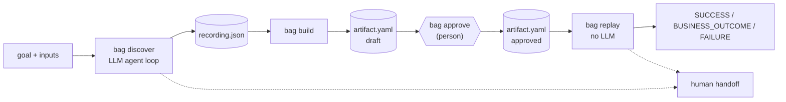
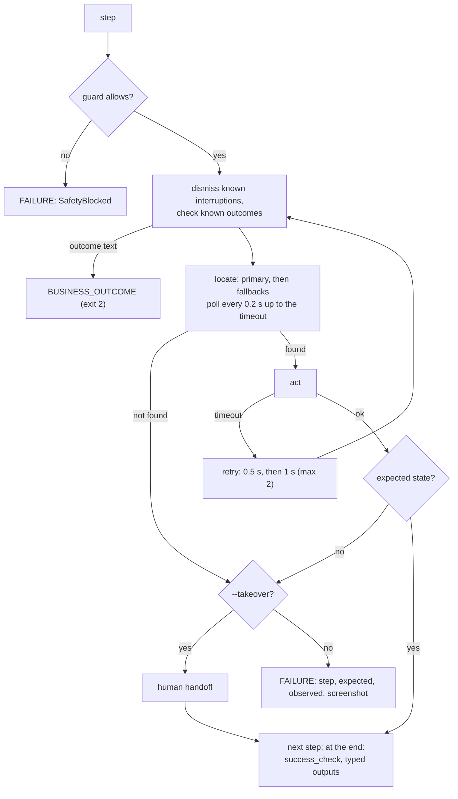
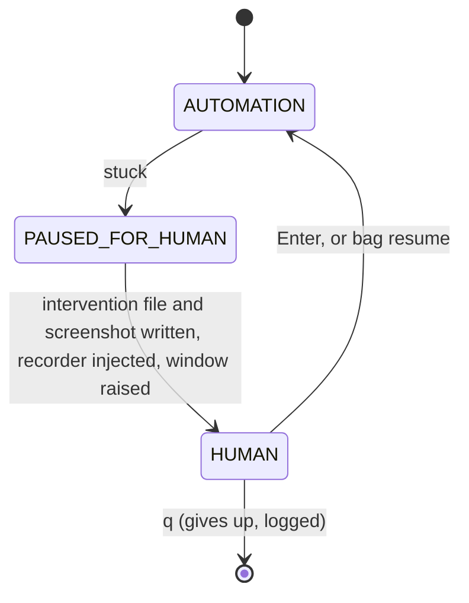

# Bank Automate GPT: design report

`bag` lets an LLM agent learn a task in a legacy bank web app once, saves the result as a reviewed YAML artifact, and replays that artifact deterministically with no LLM. A person can take over the live browser when a step cannot be done, and every run leaves redacted evidence. The target is a deliberately awkward fake bank shipped in the repo. Evidence of the full flow is in [`evidence/INDEX.md`](evidence/INDEX.md).

## 1. Architecture



Packages under `bag/`, each with one job: `bankapp` (the fake bank, Flask), `surface` (the only code that touches a page), `llm` (provider adapters), `agent` (discovery loop and recorder), `artifact` (schema, builder, store), `replay` (deterministic engine), `safety` (guard, approval, redaction, audit), `handoff` (human takeover), and `logging.py` (per-run evidence folders). A Typer CLI (`bag`) ties them together.

**Key decisions and trade-offs**

| Decision | Why | Trade-off |
|---|---|---|
| Discover once with an LLM, replay with plain code | Routine bank work must be repeatable, fast and reviewable. Replay of the balance task takes about 0.4 s against 16 s or more for discovery. | The artifact is only as good as one discovery run; a person must review it. |
| One `Surface` interface (15 methods); only `BrowserSurface` imports Playwright | Agent, replay and handoff never depend on the browser library, so a new kind of app needs only a new surface. | The interface is shaped by the web (iframes, `css`). |
| The agent sees the accessibility tree plus a blurred screenshot | The tree is short and uses human names ("Sign On"), so it survives layout changes better than raw HTML. | Unlabelled legacy fields have no name, so `observe()` lists them separately with a css selector. |
| Each LLM step is one stateless call, with history as plain sentences | Small, predictable prompts; any provider works; a bad answer cannot poison a long chat. | More tokens per step than a running conversation. |
| Provider-neutral adapters (Anthropic, Gemini, OpenAI-compatible) | Switching model is a `.env` change; `BAG_BASE_URL` covers Ollama or OpenRouter. | Only Gemini was exercised live. |
| Import rules enforced by tests | `replay`, `artifact` and `logging` provably load no LLM code; nothing outside `surface` imports Playwright. | Some extra plumbing is needed to respect these seams. |
| Plain files: YAML artifacts, JSON-lines logs | Readable, diffable, safe to append during a run, no server. | No concurrency control or tamper protection. |

## 2. Artifact schema

An artifact is `artifacts/<name>.v<version>.yaml`, validated by pydantic on every load ([`schema.py`](bag/artifact/schema.py) explains each field). A real one is [`evidence/artifacts/member-balance.v1.yaml`](evidence/artifacts/member-balance.v1.yaml).

```yaml
metadata:      {name, version, app, description, status: draft|approved, start_url, source_recording}
inputs:        [{name, type: string|int|decimal, pattern?, description}]
steps:
  - action: type|click|read|wait
    locator:
      primary:   {role: button, name: Sign On}         # exactly one of role+name | label | text | css
      fallbacks: [{css: "body > ... > input"}]         # ordered, tried only if the primary fails
      why:       "Click the Sign On button to log in." # the agent's reason, for the reviewer
    text: "{{secret:BANK_PASSWORD}}"                   # type only; placeholders, never values
    output_name: savings_balance                       # read only
    expected: {url_contains: /home}                    # optional state check after the step
outputs:             [{name, type, description}]       # read values are cast: "$250,000.00" -> 250000.00
success_check:       {outputs_present: [savings_balance]}
known_outcomes:      [{text: "No member found", outcome: NOT_FOUND}]
known_interruptions: [{text: "System maintenance notice", action: click, locator: {...}}]
```

**Why this shape**

- **A person approves it,** so it is readable YAML, each step carries the agent's `why`, and a draft cannot be replayed. Saving never overwrites a version and refuses any real secret value.
- **Locators are a primary plus ordered fallbacks.** During discovery the recorder stores every validated way of finding the element. The builder orders them role+name > label > text > bare role > css, and puts last any locator built from the value being read. Semantic names survive layout changes; css is the last resort.
- **Inputs and secrets are placeholders.** `{{member_id}}` and `{{secret:NAME}}` are filled in by the surface at type time, so one artifact serves any member and holds no credentials.
- **Business answers are data, not errors.** `known_outcomes` turns "No member found" into `NOT_FOUND`; `known_interruptions` describes popups to dismiss. Both are page-text triggers, so they apply at any step.
- **Strict loading.** Unknown keys are errors (a typo in `fallbacks` cannot be silently ignored), placeholders must be declared inputs, and every `read` must match an output.

Steps are a straight line on purpose: easy to review and easy to make deterministic. Branching is limited to outcomes and interruptions.

## 3. Determinism & error handling

**Determinism.** Replay makes no LLM call; a test imports the replay path in a fresh process and checks. The same artifact and inputs always give the same sequence of actions. Before touching the app, `prepare_run` refuses unless the artifact is approved, the inputs are exactly the declared ones and pass their type and pattern, and every secret is available ([demo-replay-3-bad-input](evidence/demo-replay-3-bad-input/console.txt): "Unknown input(s): memberid"). Locators never guess: zero matches is `TargetNotFound`, two or more is `AmbiguousTarget`.



**Error kinds.** `errors.classify()` turns surface exceptions into five kinds and re-raises anything else as a bug:

| Kind | Handling |
|---|---|
| `TransientError` (timeouts) | retry the same step, 2 times with 0.5 s / 1 s backoff |
| `LocatorNotFound` | try fallbacks; never retried (waiting will not rename a button); handoff if allowed |
| `UnexpectedState` (expected state not reached) | handoff if allowed, else FAILURE |
| `SafetyBlocked` | FAILURE, never handed to a person |
| `BusinessOutcome` | `BUSINESS_OUTCOME` with its code, exit 2 ([demo-replay-2-not-found](evidence/demo-replay-2-not-found/)) |

Every FAILURE names the step, the expected and observed state, and saves a screenshot. Exit codes are 0 success, 1 failure or refused, 2 business outcome.

**Exceptional states.** Known popups are dismissed before each step, after passing the guard. A run with an injected popup and 1 s page delays still succeeded in 6.7 s ([demo-replay-4-faults](evidence/demo-replay-4-faults/)).

**UI drift.** A fallback means "find the same element another way, now"; a retry means "do the same step again, later". Each step logs which locator matched (`via primary` or `fallback N`), so drift shows up in the logs before it breaks a run. Replay also rewrites the artifact's start URL onto `BANK_URL`'s host, so moving the app does not break it.

## 4. Heterogeneity & multi-tenant

**Other legacy web surfaces.** The fake bank already exercises the hard parts of old web apps: table layouts, no `id` attributes, a form inside an unnamed iframe, and fields labelled by a `<label>`, by neighbouring text, or not at all. Target resolution searches every frame, and `observe()` lists unnamed fields with a css selector, so none of this needs per-site code.

**Desktop surfaces.** The agent, the replay engine and the handoff only call the `Surface` interface (`observe`, `click`, `type`, `read`, `wait_for`, `locate`, ...). A desktop app would get a new class, for example over Windows UI Automation. Its controls also have roles and names, so `role` + `name` targets carry over unchanged, and `css` would map to an automation id or control path. **Not built:** only `BrowserSurface` exists, and the interface still has web-specific methods (`frame_urls`, `add_init_script`) that a desktop surface would implement as no-ops or replace.

**Many institutions running the same app.** What already works:

- The artifact stores paths, and replay puts them on the current institution's host (`BANK_URL`). The demo replays ran an artifact recorded on port 5000 against a bank on port 5059.
- Credentials are referenced by name (`{{secret:BANK_USER}}`), and each institution supplies its own values through its environment. `BAG_SECRET_NAMES` limits which variables can be typed.
- Safety rules are a per-deployment file (`--safety-config`), so each institution has its own allowed URLs and risky words.
- Locators prefer accessible names over layout, so cosmetic differences between installs land on fallbacks rather than failures.

**What I would add:** a per-tenant overlay file merged over the base artifact (renamed labels, extra interruptions, different outcome texts, input patterns), so one reviewed artifact plus small diffs serves every institution; approval per tenant; and a registry recording which tenant ran which artifact version.

## 5. Escalation & handoff

**Detecting "stuck".**

- **Discovery:** the AI can call `ask_human`. Independently, a loop guard stops the run when the same action is proposed three times in a row, including invalid or blocked ones; the wording of the reason is ignored. The step and time limits (25 steps, 600 s) are the backstop. In a real run the AI tried to type into a `<select>` three times, and the loop guard stopped it and saved a help request.
- **Replay:** a step whose element is not found by any locator within the timeout (`LocatorNotFound`), or whose expected state is not reached (`UnexpectedState`). Safety blocks, business outcomes and exhausted retries are not escalated.

**Taking control of the live session.** With `--takeover --headed`, the same browser session is handed over. It is never restarted, so the login and page state are kept.



On pause, `<id>.json` (goal, step, reason, expected, observed, URL) and a blurred screenshot are written and printed. A script injected into every frame records the person's clicks and typing with a css path and accessible name. Password and card/OTP fields are masked and their values never read. Events are copied to `sessionStorage`, so they survive the iframe loading a new page.

**Handing back.** The person presses Enter in the paused terminal, or runs `bag resume [id]` from any terminal, which drops an `<id>.resume` flag file. Keyboard input is polled rather than blocked, so both paths are watched at once. On resume the engine checks the step's expected state. A `read` step is re-run, because a person cannot hand over a value; other steps count as done by the person. More than 3 handoffs in one run fail it. In discovery, the next prompt tells the AI what the person did (never what they typed), and their time does not count against the limit. Every state change is logged ([demo-replay-5-handoff](evidence/demo-replay-5-handoff/interventions/)).

## 6. Safety

**Guardrail model.** Every action, in discovery and replay, passes `Guard.check` before it touches the page. It is a pure decision:

1. Any page or iframe URL outside `allowed_urls` → **BLOCK** (a look-alike page could harvest the real password).
2. A click whose name, label, text or css contains a risky word (confirm, submit, transfer, pay, delete, approve, authorize, wire, ...), or typing that matches a risky-field rule (amount, payee, IBAN, PIN, OTP, ...) → **NEEDS_APPROVAL**. The guard checks every known description of the element, so a button found by css is still recognised by its name.
3. Otherwise → **ALLOW**.

`NEEDS_APPROVAL` asks a person in the terminal; no terminal, or end of input, means no. The whole layer fails closed: a missing or invalid `config/safety.yaml` stops every run, and the guard is a required argument of both loops. Every decision is appended to a JSON-lines audit log ([example](evidence/demo-replay-safety-decisions.jsonl)). In the sub-account runs, the amount field and the Confirm click each stopped for a human "yes".

**Data protection.** The LLM receives input and secret *names*, never values. `BrowserSurface.observe()` is the single source of screenshots. It blurs password fields, fields holding a secret, account-number text and configured selectors before anything is saved or sent. Every log line, recording, failure report, audit entry and CLI print passes through a redactor: secrets become placeholders, and 8–19 digit account numbers keep only their last 4 digits. A scan of all 50 text files in `evidence/` found none of the `.env` secret values.

**Limits.**

- Risky-word and risky-field rules are keyword lists; a "Go" button that moves money would not trigger them.
- The URL is checked just before each action, not continuously.
- Masking misses alphanumeric IBANs, names and balances. Read outputs are kept real because they are the product.
- Blurred screenshots still go to the LLM provider (`--no-screenshot` avoids that).
- A person's actions during a handoff are not guarded; the guard re-checks the page before the next automated step.
- Approval is a terminal y/N, not tied to an identity, and `bag resume` is a local file with no authentication.

## 7. Cuts

**Deliberately left out**

- **A real target.** No real bank, MFA, CAPTCHA, downloads or desktop app. The fake bank is controllable and harmless.
- **Branching artifacts.** Straight-line steps keep replay deterministic and reviews simple.
- **Learning from the human.** Takeovers are recorded (`human-events.json`) but not merged back into the artifact.
- **A service layer.** No scheduler, queue, API or web UI; approvals and handoffs happen in a terminal.
- **Provider resilience and cost.** No retry on provider 503/429 errors (several discovery attempts ended this way) and no token or cost accounting.

**Known weaknesses found in the evidence**

- **No "select option" action.** The agent cannot choose from a `<select>`. In the sub-account task "Savings" was used only because it is the form's default, so the artifact's `account_type` input is declared but unused.
- **Brittle read locators.** Both discovered `read` steps use a positional css selector, and their fallback is the value seen during discovery (`$12,450.75`), which only matches that one case. The builder warns about value-bound locators, but a reviewer still has to fix them.
- **Popups seen during discovery become duplicate steps.** The AI's "click OK" was saved as a normal step on top of the built-in interruption. In replay the popup was dismissed first, the step's text fallback then matched the now-hidden button, and the run failed ([evidence](evidence/20261006-032143-replay-member-balance-new-v1/)).
- **Limited verification.** Only Gemini was used live, everything ran on Windows 11 with Python 3.12, and there is no CI or linter.

**What I would build next, in order**

1. Drop discovered clicks that match a known interruption, and make `locate` ignore hidden elements (fixes the popup failure).
2. A `select` action, and builder rules that turn value-bound read locators into label- or row-based ones.
3. Retry with backoff for provider errors, plus token and cost limits per discovery.
4. Turn a human takeover into proposed artifact steps for review (repair by demonstration).
5. Per-tenant overlays and approval per tenant (section 4).
6. A second surface (Windows UI Automation) to prove the interface beyond the web.
7. Signed, identity-bound approvals and an authenticated resume channel.
